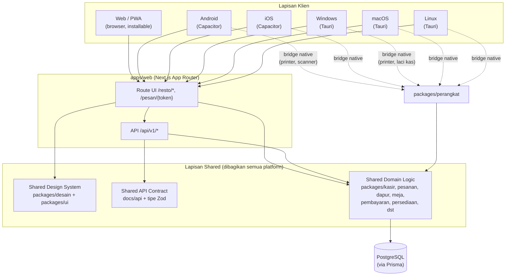
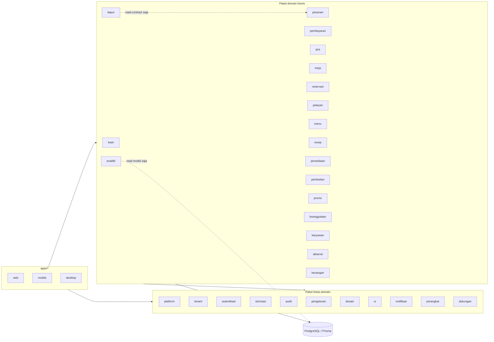

# Arsitektur Sistem Altora Resto

## 1. Gambaran umum

Altora Resto adalah **satu basis kode** (monorepo) yang dijalankan di banyak bentuk (web, PWA, mobile native, desktop native), dengan **satu backend API** dan **satu database** per deployment (multi-tenant di level data, bukan di level deployment terpisah per tenant).

Poin kunci:

- **Satu Shared Domain Logic** (`packages/*`) dipakai oleh route UI maupun endpoint API - tidak ada duplikasi aturan bisnis antara "yang ditampilkan" dan "yang divalidasi di server".
- **Satu Shared API Contract**: semua request/response divalidasi dengan skema Zod yang sama, dipakai baik oleh handler API (validasi input) maupun klien (tipe response), sehingga kontrak tidak pernah "diam-diam berbeda" antar platform.
- **Satu Shared Design System** (`packages/desain` untuk token, `packages/ui` untuk komponen) dipakai di semua platform sehingga tampilan konsisten, hanya berbeda pada shell native (Capacitor/Tauri) dan aksen warna per app internal (lihat `docs/ui-ux/DESIGN-TOKENS.md`).
- **apps/mobile** dan **apps/desktop** tidak menduplikasi UI - keduanya membungkus `apps/web` (mode WebView/WebView2) dan hanya menambah jembatan (bridge) ke kapabilitas native lewat `packages/perangkat`.

## 2. Lapisan paket -> domain -> database

Aturan boundary di atas ditegakkan otomatis lewat `.dependency-cruiser.cjs` (`pnpm depcheck`):

1. `ui` tidak boleh mengimpor paket bisnis apa pun.
2. Paket bisnis boleh mengimpor `ui` dan `desain`.
3. `dapur` hanya boleh membaca read-contract "kitchen order" dari `pesanan` (`@altora/pesanan/kontrak-dapur`), tidak boleh menulis/mengimpor internal pesanan.
4. `analitik` hanya boleh membaca dari read-model (tabel/tipe read-model), tidak pernah dari tabel/paket transaksional mentah secara langsung.

## 3. Multi-tenant & multi-outlet

Setiap baris data transaksional membawa `tenantId` dan `outletId` (lihat bagian 11 spesifikasi induk dan `prisma/schema/`). Resolusi tenant/outlet terjadi di `packages/tenant` dan diteruskan sebagai konteks request ke seluruh lapisan domain - tidak ada query yang boleh melewati filter tenant/outlet.

## 4. Referensi

- ERD lengkap: `docs/database/`
- Kontrak API: `docs/api/`
- State machine: `docs/arsitektur/STATE-MACHINES.md`
- Token desain & aksen per app: `docs/ui-ux/DESIGN-TOKENS.md`
