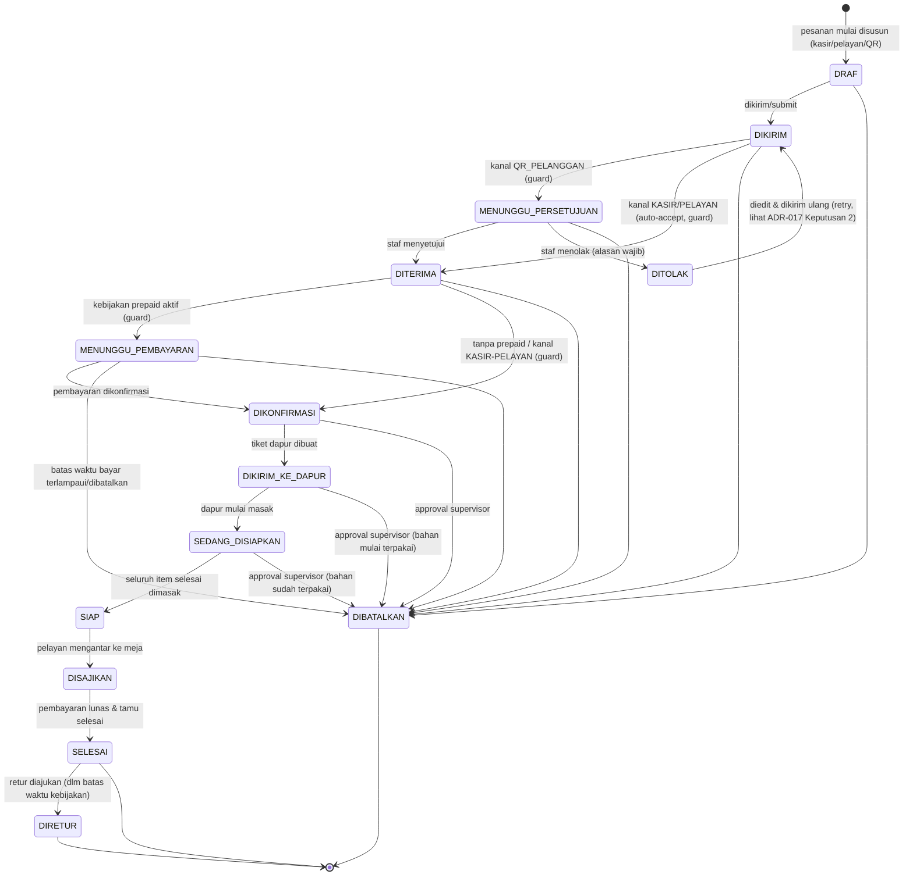
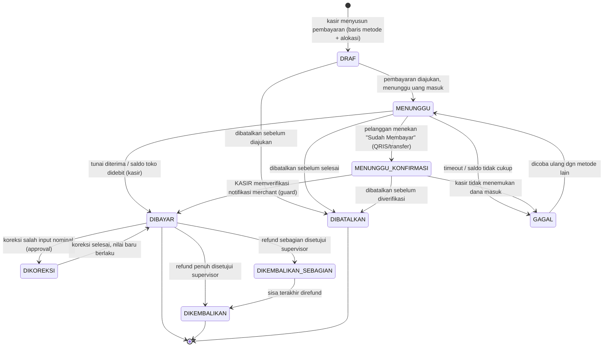
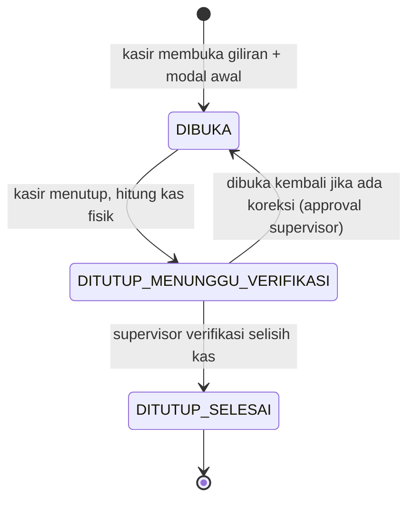
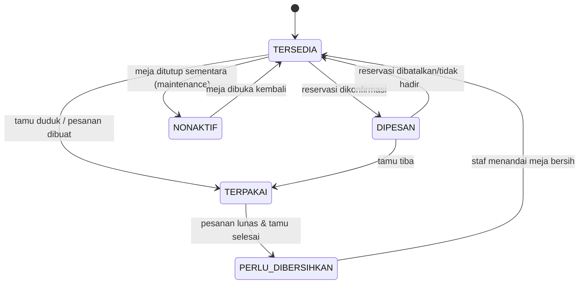
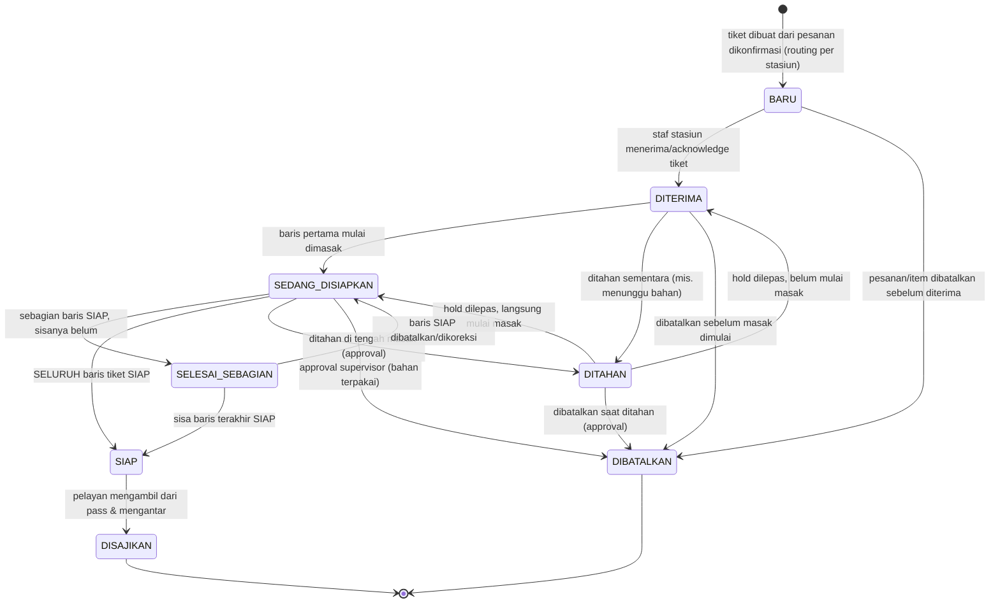
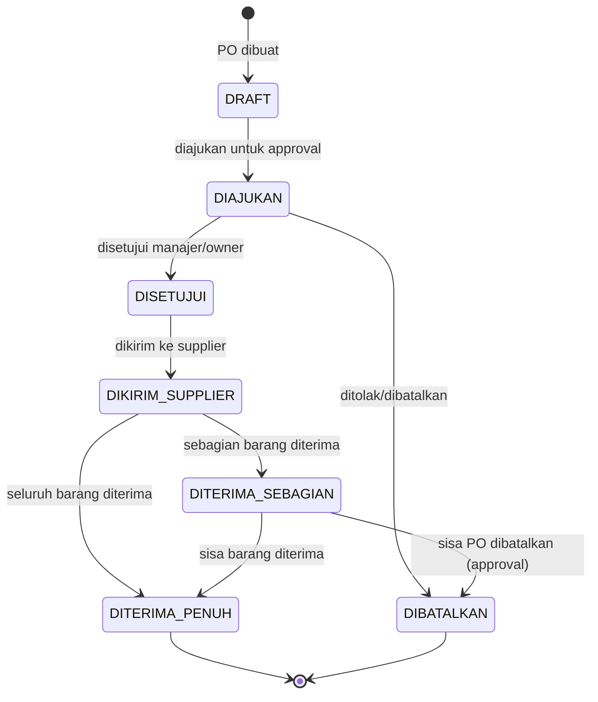
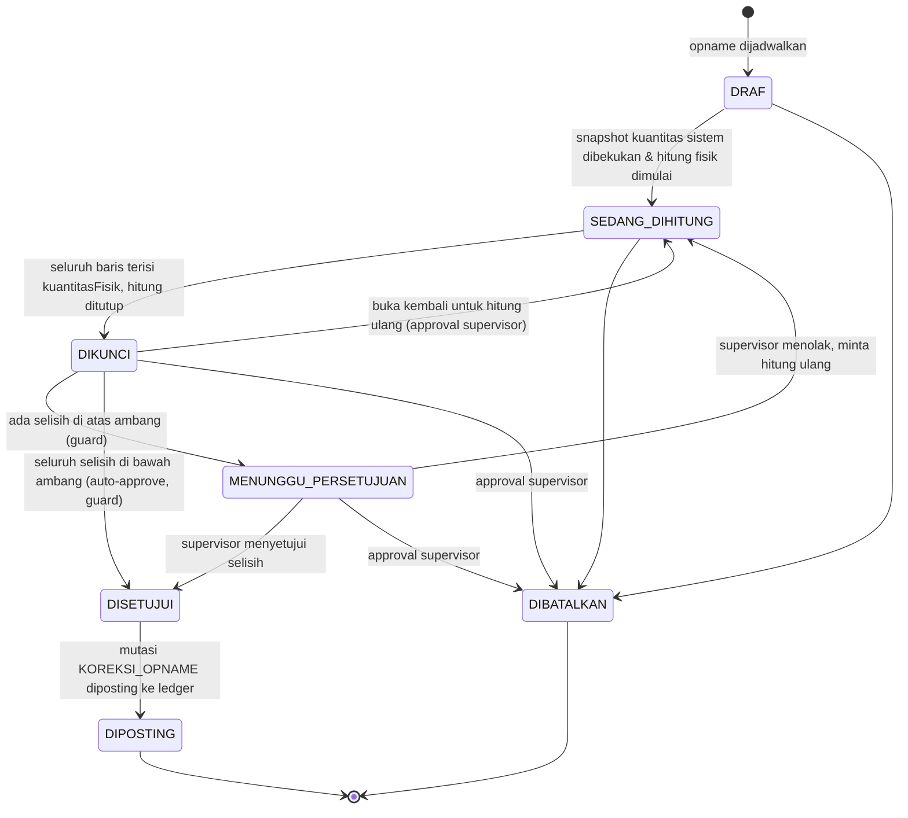
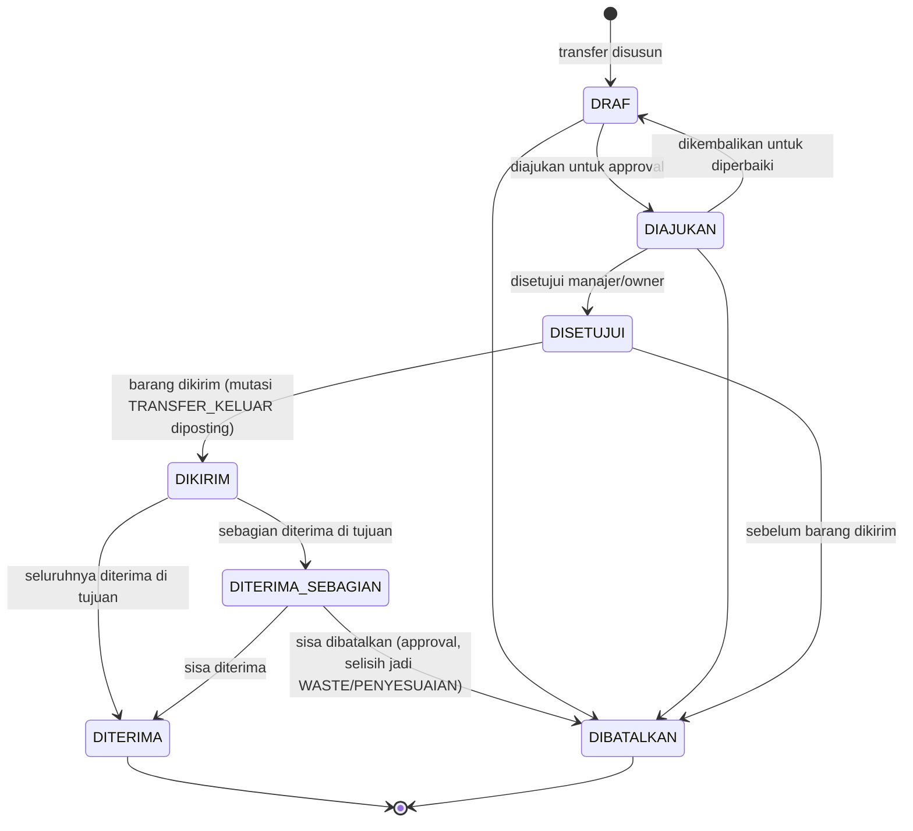
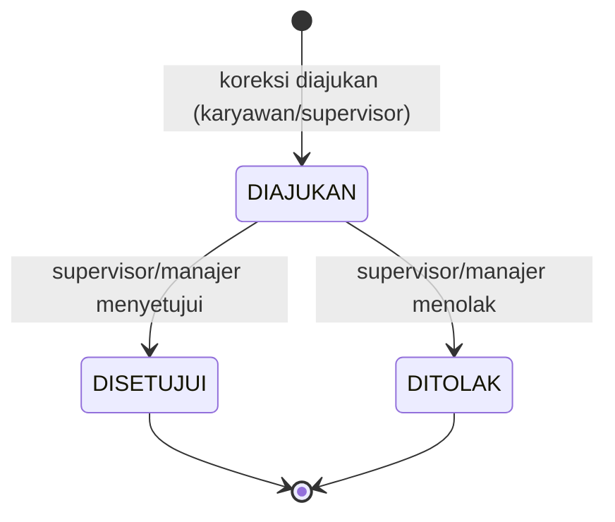
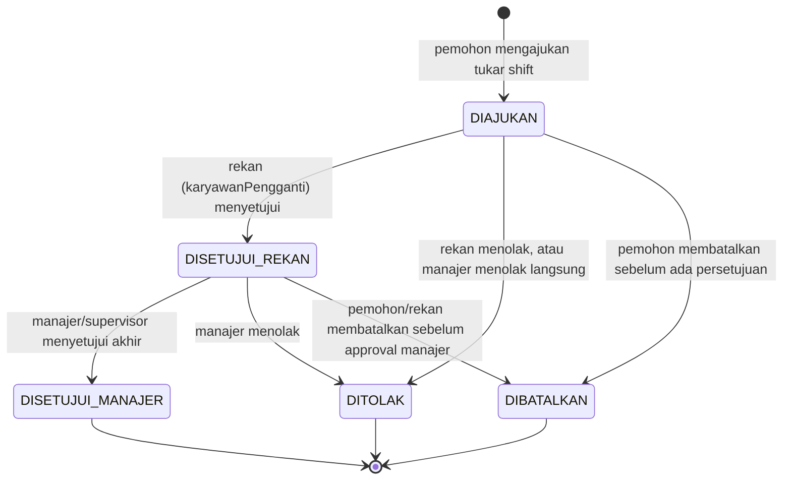

# State Machine Inti Altora Resto

Delapan state machine inti yang menjadi tulang punggung alur operasional restoran.

**ALT-DEF-008 (correction-loop lanjutan):** bagian 7 (Opname) ditulis ulang
penuh - diagram lama 4-status (`DIRENCANAKAN`/`BERLANGSUNG`/`SELESAI`/
`DIBATALKAN`) tidak punya tempat sama sekali untuk `ALT-PSD-017` (approval
selisih signifikan) - dan bagian 8 (Transfer Stok) adalah **baru**. Tiga baris
di bagian 1 dan 5 yang merujuk `MutasiStok.jenis = RETUR` diperbarui menjadi
`RETUR_PENJUALAN`: nilai enum `RETUR` **sudah tidak ada lagi** setelah ADR-023
Keputusan 2, dan membiarkan rujukan ke nilai yang tidak ada membuat dokumen ini
salah secara diam-diam.

## 1. Pesanan

**ALT-DEF-005 (correction-loop lanjutan):** diagram dan tabel di bawah
menggantikan diagram lama 7-status (BARU/DIKONFIRMASI/DIPROSES_DAPUR/
SIAP_DISAJIKAN/DISAJIKAN/DIBAYAR/DIBATALKAN). Lihat ADR-017 di
`docs/engineering/DECISION-LOG.md` untuk rasional desain lengkap dan
keputusan yang diambil untuk setiap ambiguitas.

Catatan penting yang TIDAK terlihat langsung di diagram (lihat tabel penuh
di bawah untuk detail per baris):

- `DIBATALKAN` **TIDAK** dapat dicapai dari `SIAP`/`DISAJIKAN`/`SELESAI` -
  begitu makanan siap/disajikan, jalur yang benar adalah `DIRETUR` (setelah
  `SELESAI`) atau pembatalan level-item (`ItemPesanan.status = DIBATALKAN`).
- `DIRETUR` **HANYA** dapat dicapai dari `SELESAI`.
- Cabang `DIKIRIM -> MENUNGGU_PERSETUJUAN` vs `DIKIRIM -> DITERIMA` dan
  `DITERIMA -> MENUNGGU_PEMBAYARAN` vs `DITERIMA -> DIKONFIRMASI` adalah
  transisi **otomatis oleh sistem** berdasarkan guard (`kanal`/kebijakan
  prepaid tenant), bukan pilihan manual staf.

### Tabel transisi lengkap

| statusAsal | statusTujuan | aktorDiizinkan | guard | sideEffect | auditEvent | testRequired |
|---|---|---|---|---|---|---|
| DRAF | DIKIRIM | PELAYAN/KASIR (izin `pesanan.buat`) atau publik via token QR meja aktif (`ALT-MJ-009`), tanpa `izin.kode` | Pesanan punya minimal 1 `ItemPesanan`; untuk kanal `QR_PELANGGAN`, `SesiMejaQr` masih aktif (belum `ditutupPada`) | Tidak ada efek samping lain (murni transisi status) | `order.submitted` | `pesanan_transisi_draf_ke_dikirim_valid` |
| DIKIRIM | MENUNGGU_PERSETUJUAN | sistem (otomatis) | `kanal == QR_PELANGGAN` | Notifikasi in-app ke staf kasir/pelayan outlet (`Notification.tipe = PESANAN_QR_MASUK`) | `order.submitted` (payload menyertakan status baru) | `pesanan_qr_masuk_menunggu_persetujuan` |
| DIKIRIM | DITERIMA | sistem (otomatis) | `kanal IN (KASIR, PELAYAN)` | Tidak ada efek samping tambahan | `order.accepted` | `pesanan_staf_auto_diterima` |
| MENUNGGU_PERSETUJUAN | DITERIMA | KASIR/PELAYAN/MANAJER (izin `pesanan.terima`) | Pesanan belum kadaluarsa (mis. sesi QR meja masih aktif) | Tidak ada efek samping tambahan | `order.accepted` | `pesanan_qr_disetujui_staf` |
| MENUNGGU_PERSETUJUAN | DITOLAK | KASIR/PELAYAN/MANAJER (izin `pesanan.tolak`) | `alasan` wajib diisi (non-empty) | Tulis 1 baris `PesananPenolakan` (`alasan`, `ditolakOlehId`) | `order.rejected` | `pesanan_qr_ditolak_staf_dengan_alasan` |
| DITOLAK | DIKIRIM | Pemesan asli (pelanggan via token QR, atau pelayan yang mengoreksi) | Sesi/token QR meja masih aktif (kanal `QR_PELANGGAN`); pesanan diedit dulu (lihat `PesananPerubahan`) sebelum dikirim ulang | Tidak menghapus baris `Pesanan`/`PesananPenolakan` lama (lihat ADR-017 Keputusan 3, TODO batch berikutnya) | `order.submitted` | `pesanan_ditolak_dikirim_ulang_retry` |
| DITERIMA | MENUNGGU_PEMBAYARAN | sistem (otomatis) | Kebijakan tenant `wajibBayarDimuka = true` (mis. QR self-order tanpa staf pengawas) | Buat baris `Pembayaran` berstatus `DRAF` beserta baris `AlokasiPembayaran` ke pesanan ini (ALT-DEF-014/ADR-019) | `payment.awaiting_confirmation` | `pesanan_prepaid_menunggu_pembayaran` |
| DITERIMA | DIKONFIRMASI | sistem (otomatis) | Kebijakan tenant `wajibBayarDimuka = false`, ATAU `kanal IN (KASIR, PELAYAN)` (bayar di akhir) | Tidak ada efek samping tambahan | `order.updated` | `pesanan_tanpa_prepaid_langsung_konfirmasi` |
| MENUNGGU_PEMBAYARAN | DIKONFIRMASI | KASIR (verifikasi pembayaran, izin `pembayaran.buat`) | Total `AlokasiPembayaran.jumlah` untuk pesanan ini atas `Pembayaran` berstatus `DIBAYAR` sudah `>= totalAkhir` (atau sesuai kebijakan DP tenant) - ALT-DEF-014/ADR-019 | Update baris `Pembayaran` terkait menjadi `DIBAYAR` (lihat state machine Pembayaran, bagian 2) | `payment.confirmed` | `pesanan_prepaid_lunas_dikonfirmasi` |
| MENUNGGU_PEMBAYARAN | DIBATALKAN | sistem (batas waktu bayar terlampaui) atau pelanggan (batalkan sendiri) | Batas waktu pembayaran (kebijakan tenant) terlampaui TANPA pembayaran masuk | Tulis 1 baris `PesananPembatalan` (`alasan = "Batas waktu pembayaran dimuka terlampaui"` atau alasan pelanggan) | `order.cancelled` | `pesanan_prepaid_timeout_dibatalkan` |
| DIKONFIRMASI | DIKIRIM_KE_DAPUR | sistem/KASIR/PELAYAN (izin `pesanan.status.ubah`) | Seluruh `ItemPesanan` berstatus valid untuk dikirim (bukan `DIBATALKAN`/`DIRETUR`) | Buat **satu atau lebih** `TiketDapur` - satu per stasiun tujuan per gelombang, sesuai `AturanRoutingDapur` (kardinalitas 1:N sejak ALT-DEF-006/ADR-018, lihat bagian 5); reservasi/pengurangan stok bahan sesuai resep bila berlaku | `order.sent_to_kitchen` | `pesanan_dikonfirmasi_kirim_ke_dapur` |
| DIKIRIM_KE_DAPUR | SEDANG_DISIAPKAN | DAPUR (event internal `TiketDapur.status = SEDANG_DISIAPKAN`, lihat bagian 5) | Minimal 1 `TiketDapur` milik pesanan ini masuk `SEDANG_DISIAPKAN` (minimal 1 baris `TiketDapurBaris` mulai dimasak) | Tidak ada efek samping tambahan di level Pesanan (state dapur granular ada di `TiketDapur`) | `kitchen.started` | `pesanan_dapur_mulai_diproses` |
| SEDANG_DISIAPKAN | SIAP | DAPUR (event internal `TiketDapur.status = SIAP`) | **SELURUH** `TiketDapur` milik pesanan ini berstatus `SIAP`/`DISAJIKAN` (masing-masing tiket sendiri baru `SIAP` bila seluruh `TiketDapurBaris`-nya `SIAP`) - agregat lintas-stasiun sejak ALT-DEF-006/ADR-018 | Notifikasi in-app ke pelayan (`Notification.tipe = PESANAN_SIAP`) | `kitchen.ready` | `pesanan_seluruh_tiket_dapur_siap` |
| SIAP | DISAJIKAN | PELAYAN (izin `pesanan.status.ubah`) | - | Update `Meja.status` terkait jika relevan (di luar scope perubahan skema batch ini) | `order.served` | `pesanan_disajikan_ke_meja` |
| DISAJIKAN | SELESAI | KASIR (verifikasi pelunasan, izin `pembayaran.buat`/`pesanan.status.ubah`) | Total `AlokasiPembayaran.jumlah` untuk pesanan ini atas `Pembayaran` berstatus `DIBAYAR` `>= totalAkhir` (agregat lintas-pembayaran sejak ALT-DEF-014/ADR-019 - mendukung pembayaran bertahap) | Tidak ada efek samping tambahan (pelunasan sudah tercatat di `Pembayaran`) | `order.completed` | `pesanan_lunas_selesai` |
| SELESAI | DIRETUR | KASIR/MANAJER (izin `pesanan.retur.kelola`), butuh approval supervisor | Dalam batas waktu kebijakan retur tenant; model detail `PesananRetur` adalah scope `ALT-PES-018` (batch berikutnya); refund dananya lewat `PembayaranRefund` (bagian 2) | Refund tercatat sebagai baris `PembayaranRefund`; model `PesananRetur` di luar scope batch ini (`ALT-PES-018`) | `order.returned` | `pesanan_retur_setelah_selesai` (batch berikutnya) |
| DRAF | DIBATALKAN | Pemesan asli / KASIR/PELAYAN (izin `pesanan.batalkan`) | - | Tulis 1 baris `PesananPembatalan` | `order.cancelled` | `pesanan_draf_dibatalkan` |
| DIKIRIM | DIBATALKAN | KASIR/PELAYAN (izin `pesanan.batalkan`) | - | Tulis 1 baris `PesananPembatalan` | `order.cancelled` | `pesanan_dikirim_dibatalkan` |
| MENUNGGU_PERSETUJUAN | DIBATALKAN | KASIR/PELAYAN (izin `pesanan.batalkan`) | Dibatalkan sebelum sempat diputuskan terima/tolak | Tulis 1 baris `PesananPembatalan` | `order.cancelled` | `pesanan_menunggu_persetujuan_dibatalkan` |
| DITERIMA | DIBATALKAN | KASIR/PELAYAN (izin `pesanan.batalkan`) | - | Tulis 1 baris `PesananPembatalan` | `order.cancelled` | `pesanan_diterima_dibatalkan` |
| MENUNGGU_PEMBAYARAN | DIBATALKAN | KASIR/PELAYAN/pelanggan (izin `pesanan.batalkan` atau self-cancel) | - | Tulis 1 baris `PesananPembatalan` | `order.cancelled` | `pesanan_menunggu_pembayaran_dibatalkan_manual` |
| DIKONFIRMASI | DIBATALKAN | SUPERVISOR ke atas (izin `pesanan.batalkan`, `BatasIzin.wajibPersetujuanManajer`) | Approval supervisor wajib (mis. stok habis ditemukan setelah konfirmasi) | Tulis 1 baris `PesananPembatalan` (`dibatalkanOlehId` = supervisor penyetuju) | `order.cancelled` | `pesanan_dikonfirmasi_dibatalkan_approval` |
| DIKIRIM_KE_DAPUR | DIBATALKAN | SUPERVISOR ke atas (izin `pesanan.batalkan`, wajib approval) | Approval supervisor wajib; bahan mungkin sudah mulai terpakai | Tulis 1 baris `PesananPembatalan`; mutasi stok pembalik (`MutasiStok.jenis = RETUR_PENJUALAN`) bila bahan sudah dipakai | `order.cancelled` | `pesanan_kirim_dapur_dibatalkan_approval_dgn_pembalik_stok` |
| SEDANG_DISIAPKAN | DIBATALKAN | SUPERVISOR ke atas (izin `pesanan.batalkan`, wajib approval) | Approval supervisor wajib; bahan sudah terpakai | Tulis 1 baris `PesananPembatalan`; mutasi stok pembalik sebagian sesuai progres masak | `order.cancelled` | `pesanan_sedang_disiapkan_dibatalkan_approval_dgn_pembalik_stok` |

Catatan tambahan (bukan transisi status, tetapi bagian dari alur `ALT-PES-010`):

- **Perubahan pesanan pasca-DIKONFIRMASI** (tambah item/ubah kuantitas/pindah
  meja/split/merge) dicatat sebagai baris baru di `PesananPerubahan`
  (`jenisPerubahan` enum, `sebelum`/`sesudah` snapshot Json) - TIDAK
  mengubah `StatusPesanan` secara langsung, dan tidak menimpa `ItemPesanan`
  secara diam-diam. `auditEvent`: `order.updated`. `testRequired`:
  `pesanan_perubahan_tercatat_sebagai_baris_baru`.

## 2. Pembayaran

**ALT-DEF-004/ALT-DEF-014 (correction-loop lanjutan):** diagram dan tabel di bawah
menggantikan diagram lama 5-status (`MENUNGGU`/`DIKONFIRMASI`/`GAGAL`/
`DIBATALKAN`/`DIREFUND`), yang bahkan menyebut jalur "kartu approved" - metode
yang tidak ada dalam produk ini (`ALT-QRS-010`). Lihat ADR-019 (restrukturisasi
alokasi pembayaran), ADR-020 (state machine ini), dan ADR-021 (konfigurasi QRIS)
di `docs/engineering/DECISION-LOG.md`.

**Perubahan kardinalitas penting:** satu `Pembayaran` **tidak lagi** terikat 1:1
ke satu `Pesanan`. Ia adalah satu PERISTIWA penerimaan uang; keterkaitannya ke
pesanan selalu lewat baris `AlokasiPembayaran`. State machine di bawah berlaku
**per-Pembayaran**, bukan per-pesanan - status pelunasan sebuah `Pesanan` adalah
turunan AGREGAT dari alokasi seluruh pembayaran yang berstatus `DIBAYAR`.

Catatan penting yang TIDAK terlihat langsung di diagram:

- **`MENUNGGU_KONFIRMASI -> DIBAYAR` HANYA boleh dilakukan KASIR.** Tombol
  "Sudah Membayar" milik pelanggan **tidak pernah** menghasilkan `DIBAYAR` -
  paling jauh `MENUNGGU_KONFIRMASI`. Ini guard keamanan finansial paling penting
  di domain ini (ADR-020 Keputusan 2, ADR-021 Keputusan 4): tanpa guard ini,
  siapa pun yang memegang link QR meja dapat menandai tagihannya sendiri lunas.
  Tidak boleh ada jalur kode apa pun dari endpoint yang dapat diakses pelanggan
  menuju `DIBAYAR`.
- **`DIBATALKAN` TIDAK dapat dicapai dari `DIBAYAR`.** Uang yang sudah diterima
  tidak "dibatalkan" - jalurnya adalah `DIKOREKSI` (salah input) atau
  `DIKEMBALIKAN_SEBAGIAN`/`DIKEMBALIKAN` (refund), keduanya append-only.
- **Kedua invariant jumlah (ADR-019 Keputusan 4) wajib terpenuhi pada SETIAP
  transisi keluar dari `DRAF`** dan diverifikasi ulang setiap kali baris metode/
  alokasi berubah:
  `SUM(PembayaranMetodeBaris.jumlah) == Pembayaran.jumlah` DAN
  `SUM(AlokasiPembayaran.jumlah) == Pembayaran.jumlah`. Validasi dilakukan
  server-side di dalam satu transaksi DB - Prisma/Postgres tidak menegakkannya.
  Ini tidak diulang di kolom `guard` tiap baris.
- **`DIKEMBALIKAN_SEBAGIAN` vs `DIKEMBALIKAN`** ditentukan agregat
  `SUM(PembayaranRefund.jumlah)` terhadap `Pembayaran.jumlah` (`<` vs `==`);
  `>` wajib ditolak (ADR-020 Keputusan 4).

### Tabel transisi lengkap

| statusAsal | statusTujuan | aktorDiizinkan | guard | sideEffect | auditEvent | testRequired |
|---|---|---|---|---|---|---|
| (baru) | DRAF | KASIR (izin `pembayaran.buat`) atau sistem (pesanan prepaid, `DITERIMA -> MENUNGGU_PEMBAYARAN`) | Giliran kasir sedang `DIBUKA` (`ALT-KSR-001`) untuk pembayaran yang diinisiasi kasir | Buat 1 baris `Pembayaran` (`status = DRAF`, `jumlah` dihitung server-side) beserta baris `PembayaranMetodeBaris` dan `AlokasiPembayaran` awal | `payment.created` | `pembayaran_dibuat_sebagai_draf` |
| DRAF | MENUNGGU | KASIR (izin `pembayaran.buat`) | **Kedua invariant jumlah terpenuhi**; minimal 1 baris `AlokasiPembayaran` dan 1 baris `PembayaranMetodeBaris`; setiap `Pesanan` yang dialokasikan milik outlet yang sama | Untuk metode `QRIS_MANUAL`: hasilkan payload QRIS bernominal dari `KonfigurasiQris` outlet yang berstatus `AKTIF` (`ALT-QRS-006`, nominal SELALU server-side) | `payment.awaiting_confirmation` | `pembayaran_draf_diajukan_invariant_terpenuhi` |
| DRAF | DIBATALKAN | KASIR (izin `transaksi.batalkan`) | Belum ada uang diterima | Tidak ada mutasi kas; baris `Pembayaran` tetap ada (no hard-delete, ADR-006) | `payment.cancelled` | `pembayaran_draf_dibatalkan` |
| MENUNGGU | DIBAYAR | KASIR (izin `pembayaran.buat`) | Metode `TUNAI` (`totalDiterima >= jumlah`, `kembalian = totalDiterima - jumlah`) ATAU `SALDO_TOKO` (saldo pelanggan mencukupi). **Metode `QRIS_MANUAL`/`TRANSFER_MANUAL` TIDAK boleh lewat jalur ini** - wajib melalui `MENUNGGU_KONFIRMASI` | Set `dikonfirmasiOlehId`/`dikonfirmasiPada`; tulis `TransaksiKasir` (`jenis = PENJUALAN`); buat `Struk`; untuk tiap `AlokasiPembayaran`, evaluasi ulang pelunasan `Pesanan` terkait (`Pesanan` menjadi `SELESAI`/`DIKONFIRMASI` bila total alokasi `DIBAYAR` `>= totalAkhir`); buka laci kas bila `TUNAI` (`ALT-UX-011`) | `payment.confirmed` | `pembayaran_tunai_langsung_dibayar_dgn_kembalian` |
| MENUNGGU | MENUNGGU_KONFIRMASI | **Pelanggan** via token QR meja aktif (tanpa `izin.kode`) ATAU KASIR/PELAYAN atas nama pelanggan | Metode `QRIS_MANUAL` atau `TRANSFER_MANUAL`; pelanggan menekan "Sudah Membayar". **Tidak ada guard yang dapat membuat aksi ini menghasilkan `DIBAYAR`** (ADR-020 Keputusan 2) | Notifikasi in-app ke kasir outlet (`Notification.tipe = PEMBAYARAN_PERLU_KONFIRMASI`) - kasir diminta memeriksa notifikasi merchant | `payment.awaiting_confirmation` | `pembayaran_tombol_pelanggan_tidak_pernah_menghasilkan_dibayar` |
| MENUNGGU | GAGAL | sistem (timeout) atau KASIR | Batas waktu pembayaran terlampaui, ATAU saldo toko tidak mencukupi (`SALDO_TOKO`) | Tidak ada mutasi kas; alokasi tidak dihitung sebagai pelunasan | `payment.failed` | `pembayaran_menunggu_timeout_gagal` |
| MENUNGGU | DIBATALKAN | KASIR (izin `transaksi.batalkan`) atau pelanggan (self-cancel) | Belum ada uang diterima | Tidak ada mutasi kas | `payment.cancelled` | `pembayaran_menunggu_dibatalkan` |
| MENUNGGU_KONFIRMASI | DIBAYAR | **HANYA KASIR/SUPERVISOR** (izin `pembayaran.qris.konfirmasi-manual`) | Kasir telah memverifikasi dana masuk di aplikasi merchant/mutasi rekening. **Aktor pelanggan DILARANG mutlak pada transisi ini** - endpoint yang dapat diakses lewat token QR meja tidak boleh punya jalur menuju status ini | Tulis 1 baris `QrisKonfirmasiManual` (`diverifikasiOlehId`, `catatanKasir` opsional) **dalam transaksi yang sama**; set `dikonfirmasiOlehId`/`dikonfirmasiPada`; tulis `TransaksiKasir`; buat `Struk`; evaluasi ulang pelunasan tiap `Pesanan` teralokasi | `payment.confirmed` | `pembayaran_qris_hanya_kasir_yang_boleh_mengonfirmasi` |
| MENUNGGU_KONFIRMASI | GAGAL | KASIR/SUPERVISOR (izin `pembayaran.qris.konfirmasi-manual`) | Kasir TIDAK menemukan dana masuk setelah memeriksa notifikasi merchant | Tidak ada baris `QrisKonfirmasiManual` yang ditulis (tidak ada yang diverifikasi) | `payment.failed` | `pembayaran_qris_dana_tidak_ditemukan_gagal` |
| MENUNGGU_KONFIRMASI | DIBATALKAN | KASIR (izin `transaksi.batalkan`) | Dibatalkan sebelum sempat diverifikasi (mis. pelanggan membatalkan klaimnya) | Tidak ada mutasi kas | `payment.cancelled` | `pembayaran_menunggu_konfirmasi_dibatalkan` |
| GAGAL | MENUNGGU | KASIR (izin `pembayaran.buat`) | Pelanggan mencoba ulang dengan metode lain - baris `PembayaranMetodeBaris` diganti, kedua invariant jumlah diverifikasi ulang | Baris metode lama TIDAK dihapus diam-diam bila sudah ada uang tercatat; pada kasus `GAGAL` belum ada uang masuk sehingga penggantian baris aman | `payment.retried` | `pembayaran_gagal_dicoba_ulang_metode_lain` |
| DIBAYAR | DIKOREKSI | SUPERVISOR ke atas (izin `transaksi.koreksi-pembayaran`, `BatasIzin.wajibPersetujuanManajer`) | Approval supervisor wajib; `alasan` wajib diisi | Tulis 1 baris `KoreksiPembayaran` (`jumlahSebelum`, `jumlahSesudah`, `dikoreksiOlehId`) - baris `Pembayaran` asli TIDAK ditimpa diam-diam; tulis `TransaksiKasir` (`jenis = KOREKSI`) | `payment.corrected` | `pembayaran_dikoreksi_tercatat_sebagai_baris_baru` |
| DIKOREKSI | DIBAYAR | SUPERVISOR (izin `transaksi.koreksi-pembayaran`) | Nilai baru berlaku; **kedua invariant jumlah wajib diverifikasi ulang** terhadap `jumlah` yang sudah dikoreksi | Perbarui baris `AlokasiPembayaran`/`PembayaranMetodeBaris` terkait dalam transaksi yang sama; evaluasi ulang pelunasan tiap `Pesanan` teralokasi | `payment.confirmed` (payload koreksi) | `pembayaran_koreksi_selesai_invariant_diverifikasi_ulang` |
| DIBAYAR | DIKEMBALIKAN_SEBAGIAN | SUPERVISOR ke atas (izin `pembayaran.refund`, wajib approval) | `SUM(PembayaranRefund.jumlah)` setelah refund ini `< Pembayaran.jumlah`; `alasan` wajib | Tulis 1 baris `PembayaranRefund`; tulis `TransaksiKasir` (`jenis = REFUND`); mutasi stok pembalik bila retur item menyertai (`ALT-PES-018`) | `payment.refunded_partial` | `pembayaran_refund_sebagian_status_dikembalikan_sebagian` |
| DIBAYAR | DIKEMBALIKAN | SUPERVISOR ke atas (izin `pembayaran.refund`, wajib approval) | `SUM(PembayaranRefund.jumlah)` setelah refund ini `== Pembayaran.jumlah` (refund penuh sekaligus); `>` wajib DITOLAK | Tulis 1 baris `PembayaranRefund`; tulis `TransaksiKasir` (`jenis = REFUND`); alokasi pembayaran ini tidak lagi dihitung sebagai pelunasan pesanan teralokasi | `payment.refunded` | `pembayaran_refund_penuh_status_dikembalikan` |
| DIKEMBALIKAN_SEBAGIAN | DIKEMBALIKAN | SUPERVISOR ke atas (izin `pembayaran.refund`, wajib approval) | Refund terakhir membuat `SUM(PembayaranRefund.jumlah) == Pembayaran.jumlah` | Tulis 1 baris `PembayaranRefund` tambahan (baris refund sebelumnya TIDAK diubah) | `payment.refunded` | `pembayaran_sisa_terakhir_direfund_jadi_dikembalikan` |

Catatan tambahan (bukan transisi status `Pembayaran`):

- **Alokasi ke pesanan** (`AlokasiPembayaran`) dapat ditambah/diubah selama
  `Pembayaran` masih `DRAF`. Setelah `DIBAYAR`, perubahan alokasi HANYA lewat
  jalur `DIBAYAR -> DIKOREKSI -> DIBAYAR` (approval supervisor) - tidak boleh ada
  jalur diam-diam yang memindahkan uang antar pesanan.
  `auditEvent`: `payment.allocation_changed`. `testRequired`:
  `alokasi_pembayaran_tidak_bisa_diubah_diam_diam_setelah_dibayar`.
- **Konfigurasi QRIS** (`KonfigurasiQris`) punya siklus hidupnya sendiri
  (`DRAF -> MENUNGGU_VERIFIKASI -> AKTIF -> NONAKTIF`, enum
  `StatusKonfigurasiQris`) yang TERPISAH dari state machine pembayaran ini.
  Setiap transisinya wajib menulis 1 baris `RiwayatKonfigurasiQris`
  (append-only, `ALT-QRS-008`). Lihat `docs/database/16-qris.md` dan ADR-021.

## 3. Giliran Kasir (Shift)

## 4. Meja

## 5. Dapur (Tiket Dapur)

**ALT-DEF-006 (correction-loop lanjutan):** diagram dan tabel di bawah
menggantikan diagram lama 4-status (`MASUK_ANTRIAN`/`DIPROSES`/`SIAP`/
`DIAMBIL_PELAYAN`). Lihat ADR-018 di `docs/engineering/DECISION-LOG.md`
untuk rasional desain lengkap (termasuk mengapa `StatusMasakBaris` tetap
enum terpisah, Keputusan 6).

**Kardinalitas penting:** satu `Pesanan` kini menghasilkan **banyak**
`TiketDapur` (satu per stasiun tujuan per gelombang, `@@unique([pesananId,
stasiunDapurId, nomorGelombang])`). State machine di bawah berlaku
**per-tiket**, BUKAN per-pesanan - status `Pesanan` adalah turunan AGREGAT
dari seluruh tiketnya (lihat guard di bagian 1).

Catatan penting yang TIDAK terlihat langsung di diagram:

- `DIBATALKAN` **TIDAK** dapat dicapai dari `SELESAI_SEBAGIAN`/`SIAP`/
  `DISAJIKAN` - begitu ada baris yang sudah matang, jalur yang benar adalah
  pembatalan level-item (`TiketDapurBaris` dikeluarkan) atau retur di level
  `Pesanan` (`SELESAI -> DIRETUR`), konsisten dengan aturan yang sama di
  state machine `Pesanan` (bagian 1).
- `SELESAI_SEBAGIAN` hanya bermakna untuk tiket dengan **lebih dari satu**
  `TiketDapurBaris`; tiket satu-baris melompat langsung
  `SEDANG_DISIAPKAN -> SIAP`.
- `DITAHAN` adalah status **tiket**, bukan baris - `ALT-DPR-007` menyatakan
  tiket `DITAHAN` tidak dihitung dalam SLA waktu masak aktif, sehingga timer
  (`ALT-DPR-005`) berhenti selama hold.
- Setiap transisi di tabel di bawah **wajib** menulis satu baris
  `RiwayatStatusTiketDapur` (`statusSebelumnya`/`statusBaru` bertipe enum,
  `diubahOlehId` nullable untuk event sistem/timer) - ini bukan opsional dan
  tidak diulang di kolom `sideEffect` tiap baris.

### Tabel transisi lengkap

| statusAsal | statusTujuan | aktorDiizinkan | guard | sideEffect | auditEvent | testRequired |
|---|---|---|---|---|---|---|
| (baru) | BARU | sistem (otomatis, saat `Pesanan` masuk `DIKIRIM_KE_DAPUR`) | `Pesanan.status == DIKONFIRMASI` dan minimal 1 `ItemPesanan` ter-routing ke stasiun ini via `AturanRoutingDapur` (`ALT-DPR-002`) | Buat 1 `TiketDapur` per stasiun tujuan + `TiketDapurBaris` untuk tiap `ItemPesanan` yang ter-routing ke stasiun tsb (`ALT-DPR-003`/`ALT-DPR-004`); cetak tiket fisik bila printer stasiun dikonfigurasi (`ALT-DPR-011`, gagal cetak TIDAK menghambat alur data) | `kitchen.ticket_created` | `tiket_dapur_dibuat_satu_per_stasiun_tujuan` |
| BARU | DITERIMA | DAPUR/MANAJER (izin `dapur.tiket.lihat` + acknowledge di layar KDS) | Tiket belum `DIBATALKAN` | Set `mulaiDiprosesPada = null` (belum masak, hanya acknowledge); notifikasi audio KDS berhenti (`ALT-DPR-013`) | `kitchen.ticket_acknowledged` | `tiket_dapur_baru_diterima_staf` |
| BARU | DIBATALKAN | KASIR/PELAYAN/SUPERVISOR (izin `pesanan.batalkan`) | Pesanan induk dibatalkan ATAU seluruh item tiket ini dibatalkan, SEBELUM tiket diterima dapur | Seluruh `TiketDapurBaris` tiket ini ditandai keluar; tidak ada mutasi stok pembalik (bahan belum dipakai) | `kitchen.ticket_cancelled` | `tiket_dapur_baru_dibatalkan_tanpa_pembalik_stok` |
| DITERIMA | SEDANG_DISIAPKAN | DAPUR (izin `dapur.tiket.lihat`) | Minimal 1 `TiketDapurBaris` bertransisi `MENUNGGU -> DIMASAK` | Set `TiketDapur.mulaiDiprosesPada = now()` (start timer `ALT-DPR-005`); emit event ke domain Pesanan -> `Pesanan.status = SEDANG_DISIAPKAN` bila ini tiket pertama pesanan tsb yang mulai | `kitchen.started` | `tiket_dapur_mulai_disiapkan_set_waktu_mulai` |
| DITERIMA | DITAHAN | DAPUR/SUPERVISOR (izin `dapur.tiket.tahan`) | `alasan` hold wajib diisi (mis. bahan habis) | Timer SLA dihentikan (`ALT-DPR-007`: tiket `DITAHAN` tidak dihitung dalam SLA aktif) | `kitchen.ticket_held` | `tiket_dapur_diterima_ditahan_sla_berhenti` |
| DITERIMA | DIBATALKAN | KASIR/PELAYAN/SUPERVISOR (izin `pesanan.batalkan`) | Masak belum dimulai (`mulaiDiprosesPada == null`) | Tidak ada mutasi stok pembalik (bahan belum dipakai) | `kitchen.ticket_cancelled` | `tiket_dapur_diterima_dibatalkan_sebelum_masak` |
| DITAHAN | DITERIMA | DAPUR/SUPERVISOR (izin `dapur.tiket.tahan`) | Hold dilepas dan masak BELUM dimulai (`mulaiDiprosesPada == null`) | Timer SLA dilanjutkan kembali | `kitchen.ticket_released` | `tiket_dapur_hold_dilepas_kembali_diterima` |
| DITAHAN | SEDANG_DISIAPKAN | DAPUR (izin `dapur.tiket.tahan`) | Hold dilepas DAN minimal 1 baris langsung `MENUNGGU -> DIMASAK` | Set `mulaiDiprosesPada = now()` bila masih null; timer SLA dilanjutkan | `kitchen.started` | `tiket_dapur_hold_dilepas_langsung_masak` |
| DITAHAN | DIBATALKAN | SUPERVISOR ke atas (izin `pesanan.batalkan`, `BatasIzin.wajibPersetujuanManajer`) | Approval supervisor wajib | Mutasi stok pembalik (`MutasiStok.jenis = RETUR_PENJUALAN`) HANYA bila `mulaiDiprosesPada != null` | `kitchen.ticket_cancelled` | `tiket_dapur_ditahan_dibatalkan_approval` |
| SEDANG_DISIAPKAN | SELESAI_SEBAGIAN | DAPUR (izin `dapur.baris.siap`) | Minimal 1 `TiketDapurBaris` berstatus `SIAP` DAN minimal 1 baris masih `MENUNGGU`/`DIMASAK` (`ALT-DPR-008`) | Tidak ada efek samping di level `Pesanan` (belum siap keseluruhan) | `kitchen.line_ready` | `tiket_dapur_sebagian_baris_siap` |
| SEDANG_DISIAPKAN | SIAP | DAPUR (izin `dapur.tiket.siap`) | **SELURUH** `TiketDapurBaris` milik tiket ini berstatus `SIAP` (`ALT-DPR-009`) | Set `siapPada = now()` (timer berhenti, `ALT-DPR-005`); notifikasi in-app ke pelayan (`Notification.tipe = PESANAN_SIAP`); emit event ke domain Pesanan - `Pesanan.status` menjadi `SIAP` HANYA bila SELURUH tiket pesanan tsb sudah `SIAP`/`DISAJIKAN` | `kitchen.ready` | `tiket_dapur_seluruh_baris_siap_notifikasi_pelayan` |
| SEDANG_DISIAPKAN | DITAHAN | SUPERVISOR (izin `dapur.tiket.tahan`) | `alasan` hold wajib; approval supervisor karena masak sudah berjalan | Timer SLA dihentikan; baris `DIMASAK` tetap `DIMASAK` (tidak di-reset ke `MENUNGGU`) | `kitchen.ticket_held` | `tiket_dapur_ditahan_di_tengah_masak` |
| SEDANG_DISIAPKAN | DIBATALKAN | SUPERVISOR ke atas (izin `pesanan.batalkan`, wajib approval) | Approval supervisor wajib; TIDAK ada baris yang sudah `SIAP` (bila ada, tiket sudah `SELESAI_SEBAGIAN` dan pembatalan tiket penuh terlarang) | Mutasi stok pembalik sebagian (`MutasiStok.jenis = RETUR_PENJUALAN`) sesuai progres masak | `kitchen.ticket_cancelled` | `tiket_dapur_sedang_disiapkan_dibatalkan_approval_dgn_pembalik_stok` |
| SELESAI_SEBAGIAN | SIAP | DAPUR (izin `dapur.tiket.siap`) | Baris terakhir yang tersisa bertransisi ke `SIAP` - SELURUH baris kini `SIAP` | Set `siapPada = now()`; notifikasi in-app ke pelayan; emit event agregat ke domain Pesanan (lihat baris `SEDANG_DISIAPKAN -> SIAP`) | `kitchen.ready` | `tiket_dapur_selesai_sebagian_jadi_siap` |
| SELESAI_SEBAGIAN | SEDANG_DISIAPKAN | DAPUR/SUPERVISOR (izin `dapur.baris.siap`) | Koreksi: baris yang tadinya ditandai `SIAP` dikembalikan ke `DIMASAK` (salah tandai) - kini TIDAK ada lagi baris `SIAP` | Tidak ada efek samping tambahan; koreksi baris tercatat di `RiwayatStatusTiketDapur` seperti transisi lain | `kitchen.line_ready` (payload koreksi) | `tiket_dapur_koreksi_baris_salah_tandai_siap` |
| SIAP | DISAJIKAN | PELAYAN/DAPUR (izin `dapur.tiket.ambil`) | Tiket berstatus `SIAP` (`ALT-DPR-010`) | Emit event ke domain Pesanan - `Pesanan.status` menjadi `DISAJIKAN` HANYA bila SELURUH tiket pesanan tsb sudah `DISAJIKAN` | `kitchen.served` | `tiket_dapur_diambil_pelayan_disajikan` |

Catatan tambahan (bukan transisi status `TiketDapur`):

- **`GelombangDapur`** punya siklus hidupnya sendiri
  (`MENUNGGU -> DIPICU -> SELESAI`, enum `StatusGelombangDapur`) yang
  TERPISAH dari status tiap `TiketDapur` di dalamnya: satu gelombang
  menjadi `DIPICU` saat staf menekan "kirim course berikutnya"
  (`dipicuPada`/`dipicuOlehId` terisi), dan `SELESAI` saat SELURUH
  `TiketDapur` dengan `nomorGelombang` tsb berstatus `DISAJIKAN`/
  `DIBATALKAN`. Lihat ADR-018 Keputusan 3.
- **`StatusMasakBaris`** (`MENUNGGU`/`DIMASAK`/`SIAP` di `TiketDapurBaris`)
  adalah enum terpisah dan lebih halus - ia yang menjadi **guard** bagi
  transisi tiket `SEDANG_DISIAPKAN`/`SELESAI_SEBAGIAN`/`SIAP` di atas.
  Alasan tidak digabung: ADR-018 Keputusan 6.

## 6. Pembelian (Purchase Order)

## 7. Opname (Stok Opname)

**ALT-DEF-008 (correction-loop lanjutan):** diagram dan tabel di bawah
menggantikan diagram lama 4-status (`DIRENCANAKAN`/`BERLANGSUNG`/`SELESAI`/
`DIBATALKAN`). Pemetaan: `DIRENCANAKAN -> DRAF`,
`BERLANGSUNG -> SEDANG_DIHITUNG`, `SELESAI -> DIPOSTING`, `DIBATALKAN` tetap.
`DIKUNCI` dan `MENUNGGU_PERSETUJUAN` adalah status **baru yang sebelumnya
tidak punya padanan sama sekali** - tanpa keduanya, `ALT-PSD-017` (approval
selisih signifikan) tidak punya tempat untuk berdiri. Lihat ADR-025 Keputusan 5
di `docs/engineering/DECISION-LOG.md`.

Catatan penting yang TIDAK terlihat langsung di diagram:

- **`DIPOSTING` adalah status TERMINAL dan TIDAK dapat dibatalkan.** Begitu
  mutasi `KOREKSI_OPNAME` masuk ledger, membatalkannya berarti mengubah
  sejarah stok - dilarang ADR-006. Jalur koreksi yang benar adalah membuat
  mutasi PEMBALIK (`POST /mutasi-stok/{id}/balik`) atau opname baru.
- **Opname TIDAK PERNAH menulis `StokBahan` secara langsung** (ADR-023
  Keputusan 1). Ia memposting mutasi `KOREKSI_OPNAME` per baris, dan saldo
  berubah HANYA sebagai konsekuensi ledger. Kalau opname menulis saldo
  langsung, ledger dan cache berpisah pada saat yang justru paling penting
  untuk cocok.
- **`snapshotPada` dibekukan pada transisi `DRAF -> SEDANG_DIHITUNG`.** Tanpa
  pembekuan itu, "selisih" membandingkan hitungan fisik pukul 22:00 dengan
  saldo yang sudah bergerak sampai pukul 23:00, dan angkanya tidak bermakna.
- **Empat aktor terpisah** (`dibuatOlehId`, `penghitungId`, `pengunciId`,
  `penyetujuId`), bukan satu kolom `diubahOlehId`: pemisahan penghitung dari
  penyetuju adalah inti kontrol internal opname. Aturan
  `penghitungId != penyetujuId` adalah **invariant level-aplikasi** (belum ada
  CHECK constraint, lihat ADR-025 ringkasan invariant).
- Cabang `DIKUNCI -> MENUNGGU_PERSETUJUAN` vs `DIKUNCI -> DISETUJUI` adalah
  transisi **otomatis oleh sistem** berdasarkan guard
  (`PengaturanPersediaanOutlet.ambangSelisihOpname`), bukan pilihan manual.
  `ambangSelisihOpname` NULL berarti **seluruh** selisih butuh persetujuan.

### Tabel transisi lengkap

| statusAsal | statusTujuan | aktorDiizinkan | guard | sideEffect | auditEvent | testRequired |
|---|---|---|---|---|---|---|
| (baru) | DRAF | GUDANG/MANAJER (izin `persediaan.opname.kelola`) | `gudangId` milik outlet aktor; tidak ada opname lain berstatus non-terminal atas gudang yang sama | Buat 1 baris `StokOpname` (`dibuatOlehId`, `dijadwalkanPada`) tanpa baris hitung | `inventory.count_created` | `opname_dibuat_status_draf` |
| DRAF | SEDANG_DIHITUNG | GUDANG (izin `persediaan.opname.kelola`) | Waktu `dijadwalkanPada` sudah tiba (atau dimulai lebih awal dengan izin yang sama) | Set `snapshotPada = now()` dan `penghitungId`; buat baris `StokOpnameBaris` untuk tiap `(bahan, lokasi)` bersaldo di gudang tsb dengan `kuantitasSistem` = saldo saat itu, `kuantitasFisik = NULL` | `inventory.count_started` | `opname_mulai_dihitung_snapshot_dibekukan` |
| SEDANG_DIHITUNG | DIKUNCI | GUDANG/MANAJER (izin `persediaan.opname.kelola`) | **SELURUH** `StokOpnameBaris` sudah punya `kuantitasFisik` non-NULL (`ALT-PSD-016`: opname tidak bisa langsung selesai tanpa input baris hitung) | Set `dikunciPada = now()`, `pengunciId`; hitung `selisih = kuantitasFisik - kuantitasSistem` per baris | `inventory.count_locked` | `opname_dikunci_wajib_seluruh_baris_terisi` |
| SEDANG_DIHITUNG | DIBATALKAN | GUDANG/MANAJER (izin `persediaan.opname.kelola`) | `alasan` wajib diisi | Set `dibatalkanPada`; baris hitung TIDAK dihapus (ADR-006); tidak ada mutasi apa pun | `inventory.count_cancelled` | `opname_dibatalkan_saat_dihitung_tanpa_mutasi` |
| DIKUNCI | SEDANG_DIHITUNG | MANAJER ke atas (izin `persediaan.opname.setujui`) | Buka kembali untuk hitung ulang; `alasan` wajib | Kosongkan `dikunciPada`/`pengunciId`; `snapshotPada` **TIDAK** di-reset (snapshot asli tetap acuan) | `inventory.count_reopened` | `opname_dibuka_ulang_snapshot_tidak_direset` |
| DIKUNCI | MENUNGGU_PERSETUJUAN | sistem (otomatis) | Minimal 1 baris punya nilai selisih di atas `PengaturanPersediaanOutlet.ambangSelisihOpname`, ATAU ambang bernilai NULL | Notifikasi in-app ke peran MANAJER/OWNER outlet | `inventory.count_awaiting_approval` | `opname_selisih_di_atas_ambang_butuh_persetujuan` |
| DIKUNCI | DISETUJUI | sistem (otomatis) | **SELURUH** selisih bernilai di bawah ambang DAN ambang non-NULL | Set `disetujuiPada = now()`, `penyetujuId = NULL` (auto-approve sistem) | `inventory.count_approved` | `opname_selisih_kecil_auto_disetujui` |
| DIKUNCI | DIBATALKAN | MANAJER ke atas (izin `persediaan.opname.setujui`) | Approval supervisor wajib; `alasan` wajib | Set `dibatalkanPada`; tidak ada mutasi apa pun | `inventory.count_cancelled` | `opname_dikunci_dibatalkan_approval` |
| MENUNGGU_PERSETUJUAN | DISETUJUI | MANAJER/OWNER (izin `persediaan.opname.setujui`) | `penyetujuId != penghitungId` (**invariant level-aplikasi**, ADR-025 Keputusan 5) | Set `disetujuiPada = now()`, `penyetujuId` | `inventory.count_approved` | `opname_disetujui_penyetuju_bukan_penghitung` |
| MENUNGGU_PERSETUJUAN | SEDANG_DIHITUNG | MANAJER/OWNER (izin `persediaan.opname.setujui`) | Supervisor menolak angka; `alasan` wajib | Kosongkan `dikunciPada`/`pengunciId`; baris hitung dipertahankan untuk dikoreksi | `inventory.count_reopened` | `opname_ditolak_supervisor_hitung_ulang` |
| MENUNGGU_PERSETUJUAN | DIBATALKAN | MANAJER/OWNER (izin `persediaan.opname.setujui`) | Approval supervisor; `alasan` wajib | Set `dibatalkanPada`; tidak ada mutasi apa pun | `inventory.count_cancelled` | `opname_menunggu_persetujuan_dibatalkan` |
| DISETUJUI | DIPOSTING | GUDANG/MANAJER (izin `persediaan.opname.kelola`) + **wajib `Idempotency-Key`** | Status `DISETUJUI`; belum pernah diposting (`dipostingPada IS NULL`) | Untuk tiap baris dengan `selisih != 0`: buat 1 `MutasiStok` `KOREKSI_OPNAME` (`jumlah = selisih`, `referensiJenis = OPNAME`, `referensiId = stokOpnameId`) dan isi `StokOpnameBaris.mutasiKoreksiId`; set `dipostingPada = now()`. Baris `selisih = 0` **tidak** menghasilkan mutasi. `StokBahan` TIDAK ditulis langsung - ia menyusul lewat rekonsiliasi ledger | `inventory.count_posted` | `opname_diposting_menghasilkan_mutasi_koreksi_opname` |

## 8. Transfer Stok (antar gudang/outlet)

**BARU pada ALT-DEF-008** (ADR-024 Keputusan 4). Menutup gap `ALT-DEF-032`:
master spec idempotency (`ALT-PLT-018`) menyebut "transfer stok" sebagai
operasi kritis, tetapi endpoint maupun state machine-nya tidak pernah ada.

Catatan penting yang TIDAK terlihat langsung di diagram:

- **`TRANSFER_KELUAR` diposting saat `DIKIRIM`; `TRANSFER_MASUK` saat
  `DITERIMA`/`DITERIMA_SEBAGIAN` - BUKAN keduanya sekaligus.** Menulis
  keduanya pada satu titik membuat barang yang sedang di jalan tampak sudah
  menjadi saldo gudang tujuan, sehingga gudang tujuan bisa "memakai" barang
  yang belum tiba. Jeda di antara keduanya adalah barang dalam perjalanan, dan
  ia memang bukan saldo gudang mana pun.
- **`DIKIRIM` TIDAK dapat dibatalkan langsung.** Begitu `TRANSFER_KELUAR`
  masuk ledger, barang sudah keluar dari gudang asal secara pencatatan. Jalur
  yang benar adalah menerima apa adanya (`DITERIMA_SEBAGIAN`) lalu
  membatalkan sisa dengan approval, sehingga selisihnya tercatat sebagai
  `WASTE`/`PENYESUAIAN` beralasan - bukan menghilang.
- `jumlahDiminta`/`jumlahDikirim`/`jumlahDiterima` adalah **tiga kolom
  terpisah**, bukan satu kolom yang ditimpa. Selisih di antara ketiganya
  adalah seluruh alasan `DITERIMA_SEBAGIAN` ada; menimpanya menghapus
  informasi susut/kehilangan dalam perjalanan.
- Transfer **lintas outlet** sah (`outletAsalId != outletTujuanId`). Jaminan
  bahwa `gudangAsal` benar-benar milik `outletAsal` adalah composite-FK
  outlet-level `(outletAsalId, gudangAsalId) -> Gudang(outletId, id)`
  (ADR-013 poin 3) - **DIJAMIN DB**.
- `gudangAsalId != gudangTujuanId` dan `jumlahDiterima <= jumlahDikirim <=
  jumlahDiminta` adalah **invariant level-aplikasi** (utang CHECK constraint,
  lihat ADR-024 Keputusan 4).

### Tabel transisi lengkap

| statusAsal | statusTujuan | aktorDiizinkan | guard | sideEffect | auditEvent | testRequired |
|---|---|---|---|---|---|---|
| (baru) | DRAF | GUDANG/MANAJER (izin `persediaan.transfer.kelola`) | `gudangAsalId != gudangTujuanId`; aktor punya akses ke outlet asal | Buat `TransferStok` + `TransferStokBaris` (`jumlahDiminta` saja); `nomorTransfer` ditentukan server, unik per tenant | `inventory.transfer_created` | `transfer_stok_dibuat_status_draf` |
| DRAF | DIAJUKAN | GUDANG/MANAJER (izin `persediaan.transfer.kelola`) | Minimal 1 baris; seluruh `jumlahDiminta > 0` | Set `diajukanPada = now()`; notifikasi in-app ke MANAJER outlet asal | `inventory.transfer_submitted` | `transfer_stok_diajukan_wajib_ada_baris` |
| DIAJUKAN | DISETUJUI | MANAJER/OWNER (izin `persediaan.transfer.setujui`) | Stok TERSEDIA di gudang asal mencukupi seluruh baris (kecuali `izinkanStokNegatif`) | Set `disetujuiPada`, `disetujuiOlehId`. **Belum ada mutasi apa pun** - barang belum bergerak | `inventory.transfer_approved` | `transfer_stok_disetujui_belum_ada_mutasi` |
| DIAJUKAN | DRAF | MANAJER/OWNER (izin `persediaan.transfer.setujui`) | Dikembalikan untuk diperbaiki; `catatan` wajib | Kosongkan `diajukanPada` | `inventory.transfer_returned` | `transfer_stok_dikembalikan_ke_draf` |
| DIAJUKAN | DIBATALKAN | GUDANG/MANAJER (izin `persediaan.transfer.kelola`) | `catatan` wajib | Tidak ada mutasi; baris tidak dihapus (ADR-006) | `inventory.transfer_cancelled` | `transfer_stok_diajukan_dibatalkan` |
| DISETUJUI | DIKIRIM | GUDANG outlet asal (izin `persediaan.transfer.kelola`) + **wajib `Idempotency-Key`** | Seluruh baris punya `jumlahDikirim` non-NULL dan `<= jumlahDiminta`; alokasi batch FEFO/FIFO berhasil | Untuk tiap baris: 1 `MutasiStok` `TRANSFER_KELUAR` (`jumlah = -jumlahDikirim`, `gudangId = gudangAsalId`, `referensiJenis = TRANSFER`) dan isi `TransferStokBaris.mutasiKeluarId`. Set `dikirimPada`, `dikirimOlehId`; notifikasi ke gudang tujuan | `inventory.transfer_dispatched` | `transfer_stok_dikirim_hanya_mutasi_keluar` |
| DISETUJUI | DIBATALKAN | MANAJER/OWNER (izin `persediaan.transfer.setujui`) | Barang **belum** dikirim (`dikirimPada IS NULL`); `catatan` wajib | Tidak ada mutasi | `inventory.transfer_cancelled` | `transfer_stok_disetujui_dibatalkan_sebelum_kirim` |
| DIKIRIM | DITERIMA_SEBAGIAN | GUDANG outlet tujuan (izin `persediaan.transfer.terima`) + **wajib `Idempotency-Key`** | Minimal 1 baris punya `jumlahDiterima` non-NULL, DAN minimal 1 baris masih NULL atau `jumlahDiterima < jumlahDikirim` | Untuk baris yang diterima: 1 `MutasiStok` `TRANSFER_MASUK` (`jumlah = +jumlahDiterima`, `gudangId = gudangTujuanId`) dan isi `mutasiMasukId` | `inventory.transfer_received_partial` | `transfer_stok_diterima_sebagian_mutasi_masuk_parsial` |
| DIKIRIM | DITERIMA | GUDANG outlet tujuan (izin `persediaan.transfer.terima`) + **wajib `Idempotency-Key`** | **SELURUH** baris punya `jumlahDiterima == jumlahDikirim` | 1 `MutasiStok` `TRANSFER_MASUK` per baris; set `diterimaPada`, `diterimaOlehId` | `inventory.transfer_received` | `transfer_stok_diterima_penuh_mutasi_masuk_lengkap` |
| DITERIMA_SEBAGIAN | DITERIMA | GUDANG outlet tujuan (izin `persediaan.transfer.terima`) + **wajib `Idempotency-Key`** | Sisa baris kini punya `jumlahDiterima == jumlahDikirim` | `MutasiStok` `TRANSFER_MASUK` untuk sisa baris saja - baris yang sudah punya `mutasiMasukId` **tidak** diposting ulang | `inventory.transfer_received` | `transfer_stok_sisa_diterima_tanpa_posting_ganda` |
| DITERIMA_SEBAGIAN | DIBATALKAN | MANAJER/OWNER (izin `persediaan.transfer.setujui`) | Approval supervisor; `catatan` wajib berisi perlakuan selisih | Selisih (`jumlahDikirim - jumlahDiterima`) **wajib** dicatat sebagai `CatatanWaste` (`AlasanWaste` hilang-dalam-perjalanan) atau `PenyesuaianStok` beralasan - selisih TIDAK boleh menghilang tanpa jejak ledger | `inventory.transfer_cancelled` | `transfer_stok_sisa_dibatalkan_selisih_jadi_waste` |

## 9. Koreksi Absensi

**BARU pada ALT-DEF-019/ALT-DEF-025** (ADR-028 Keputusan 5, crux decision).
`Absensi.jamMasuk`/`jamPulang` IMMUTABLE - flow ini adalah SATU-SATUNYA cara
sah mengubah apa yang dianggap "waktu presensi efektif" (`jamMasukEfektif`/
`jamPulangEfektif` pada baris `Absensi` asli), lewat approval eksplisit.

Catatan penting yang TIDAK terlihat langsung di diagram:

- **`DISETUJUI` dan `DITOLAK` adalah status TERMINAL - tidak ada jalur balik
  ke `DIAJUKAN`.** Pengajuan koreksi baru atas `Absensi` yang sama (mis.
  setelah ditolak, diajukan ulang dengan alasan/nilai berbeda) selalu
  menjadi baris `KoreksiAbsensi` BARU, bukan membuka kembali baris lama -
  relasi `Absensi -> KoreksiAbsensi` sengaja one-to-many.
- **`DISETUJUI` adalah SATU-SATUNYA transisi yang punya side effect pada
  tabel lain.** `DITOLAK` tidak menyentuh `Absensi` sama sekali.
- `jamMasukSebelum`/`jamPulangSebelum` adalah SNAPSHOT yang diambil saat
  pengajuan (bukan referensi hidup) - bila `Absensi` berubah lagi sebelum
  koreksi ini diproses (mis. koreksi lain lebih dulu disetujui), snapshot
  tetap merepresentasikan apa yang dilihat pengaju saat itu, bukan nilai
  terkini.

### Tabel transisi lengkap

| statusAsal | statusTujuan | aktorDiizinkan | guard | sideEffect | auditEvent | testRequired |
|---|---|---|---|---|---|---|
| (baru) | DIAJUKAN | Karyawan pemilik `Absensi`, atau supervisor (izin `absensi.koreksi.kelola`) | `absensiId` valid dan milik tenant/outlet aktor; minimal satu dari `jamMasukSesudah`/`jamPulangSesudah` diisi; `alasan` wajib | Buat `KoreksiAbsensi` (`jamMasukSebelum`/`jamPulangSebelum` = snapshot nilai `Absensi.jamMasuk`/`jamPulang` ASLI saat ini); notifikasi in-app ke supervisor outlet | `attendance.correction_requested` | `koreksi_absensi_diajukan_snapshot_nilai_asli` |
| DIAJUKAN | DISETUJUI | MANAJER/SUPERVISOR (izin `absensi.koreksi.kelola`), **`disetujuiOlehId != diajukanOlehId`** (invariant level-aplikasi, cegah self-approval) | Belum ada koreksi lain atas `Absensi` yang sama yang masih `DIAJUKAN` dan tumpang tindih rentang waktu | Set `disetujuiOlehId`, `status = DISETUJUI`; tulis `Absensi.jamMasukEfektif`/`jamPulangEfektif` = nilai `*Sesudah` dari koreksi ini; `Absensi.jamMasuk`/`jamPulang` ASLI TIDAK disentuh | `attendance.correction_approved` | `koreksi_absensi_disetujui_tulis_efektif_bukan_asli` |
| DIAJUKAN | DITOLAK | MANAJER/SUPERVISOR (izin `absensi.koreksi.kelola`) | `alasan` penolakan wajib diisi (kolom `catatan`/field terpisah, service-layer) | Set `disetujuiOlehId` (penolak), `status = DITOLAK`; **tidak ada perubahan pada `Absensi`** | `attendance.correction_rejected` | `koreksi_absensi_ditolak_tanpa_perubahan_absensi` |

## 10. Tukar Shift

**BARU pada ALT-DEF-024** (ADR-028 Keputusan 3/`ALT-HR-008`). Jadwal ASAL
(`JadwalKerja`) tidak berubah kepemilikannya sampai `DISETUJUI_MANAJER`.

Catatan penting yang TIDAK terlihat langsung di diagram:

- **Dua tahap approval berurutan** (rekan lalu manajer) - `karyawanPengganti`
  harus menyetujui SEBELUM manajer memutuskan; manajer tidak bisa
  menyetujui langsung dari `DIAJUKAN` tanpa `DISETUJUI_REKAN` lebih dulu
  (kecuali `karyawanPenggantiId` NULL, mis. tukar shift terbuka/"siapa pun
  bisa ambil" - guard detail adalah keputusan service-layer).
- **`DISETUJUI_MANAJER` adalah SATU-SATUNYA transisi yang menulis ulang
  `JadwalKerja`.** Sebelum titik itu, `jadwalKerjaAsalId` tetap milik
  `karyawanPemohon` sepenuhnya - karyawan lain melihat jadwal lama tidak
  berubah selama proses approval berjalan.

### Tabel transisi lengkap

| statusAsal | statusTujuan | aktorDiizinkan | guard | sideEffect | auditEvent | testRequired |
|---|---|---|---|---|---|---|
| (baru) | DIAJUKAN | Karyawan pemohon (izin `karyawan.tukar-shift.kelola`) | `jadwalKerjaAsalId` milik pemohon; status `JadwalKerja` masih `DIJADWALKAN`/`DIKONFIRMASI` (belum `SELESAI`/`DIBATALKAN`) | Buat `PermintaanTukarShift`; notifikasi ke `karyawanPenggantiId` (bila diisi) atau ke seluruh karyawan eligible outlet tsb | `attendance.shift_swap_requested` | `tukar_shift_diajukan_jadwal_asal_belum_terpakai` |
| DIAJUKAN | DISETUJUI_REKAN | `karyawanPenggantiId` (izin implisit sebagai pihak yang dituju) | Permintaan belum kadaluarsa/dibatalkan | Set status; notifikasi ke MANAJER outlet untuk approval akhir | `attendance.shift_swap_peer_approved` | `tukar_shift_disetujui_rekan_lanjut_manajer` |
| DIAJUKAN | DITOLAK | `karyawanPenggantiId`, atau MANAJER (izin `karyawan.tukar-shift.kelola`) | - | Set `disetujuiOlehId` (penolak, nullable bila ditolak rekan bukan manajer) | `attendance.shift_swap_rejected` | `tukar_shift_ditolak_dari_diajukan` |
| DIAJUKAN | DIBATALKAN | Karyawan pemohon | - | Set status; tidak ada perubahan `JadwalKerja` | `attendance.shift_swap_cancelled` | `tukar_shift_dibatalkan_pemohon` |
| DISETUJUI_REKAN | DISETUJUI_MANAJER | MANAJER/SUPERVISOR (izin `karyawan.tukar-shift.kelola`) | - | Set `disetujuiOlehId`, `status = DISETUJUI_MANAJER`; `JadwalKerja.karyawanId` (baris asal) ditukar ke `karyawanPenggantiId` - baris `JadwalKerja` TIDAK dihapus/diduplikasi, hanya kepemilikannya berpindah dengan jejak `PermintaanTukarShift` sebagai bukti audit | `attendance.shift_swap_approved` | `tukar_shift_disetujui_manajer_pindah_kepemilikan_jadwal` |
| DISETUJUI_REKAN | DITOLAK | MANAJER/SUPERVISOR (izin `karyawan.tukar-shift.kelola`) | - | Set `disetujuiOlehId` (penolak), `status = DITOLAK`; `JadwalKerja` TIDAK berubah | `attendance.shift_swap_rejected` | `tukar_shift_ditolak_manajer_setelah_rekan_setuju` |
| DISETUJUI_REKAN | DIBATALKAN | Karyawan pemohon atau pengganti | - | Set status; `JadwalKerja` TIDAK berubah | `attendance.shift_swap_cancelled` | `tukar_shift_dibatalkan_setelah_rekan_setuju` |

## Catatan umum

- Semua transisi status wajib dicatat di tabel riwayat/audit terkait (`PESANAN_RIWAYAT_STATUS`, `AUDIT_LOG`, dsb) - lihat `docs/database/`.
- Transisi yang melibatkan pembatalan/koreksi finansial atau stok tidak pernah menghapus data - selalu lewat status baru atau entri pembalik, sesuai aturan no-hard-delete.
- Transisi yang memerlukan approval supervisor (mis. buka ulang giliran kasir, batalkan PO yang sudah diterima sebagian) tunduk pada limit di `docs/keamanan/PERMISSION-MATRIX.md`.
