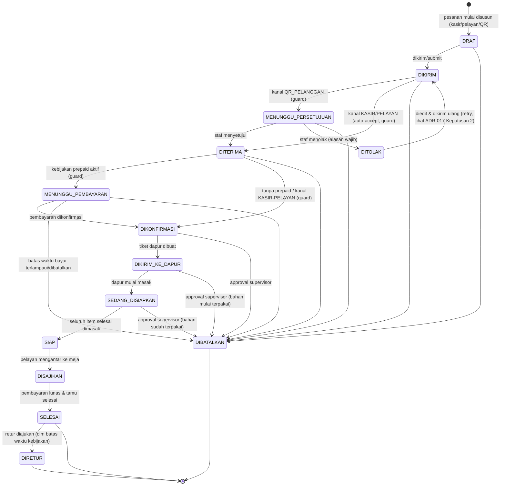
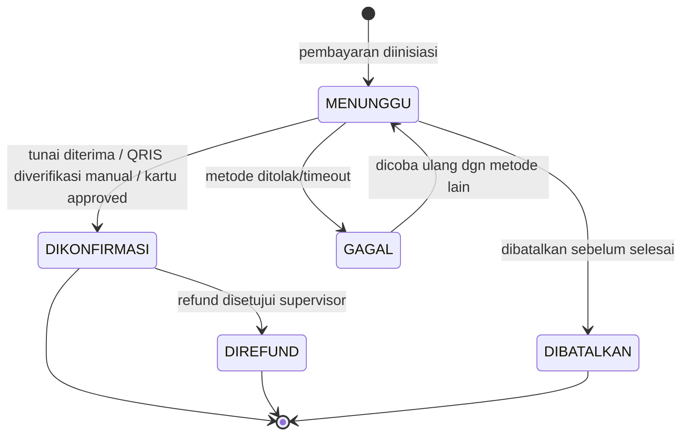
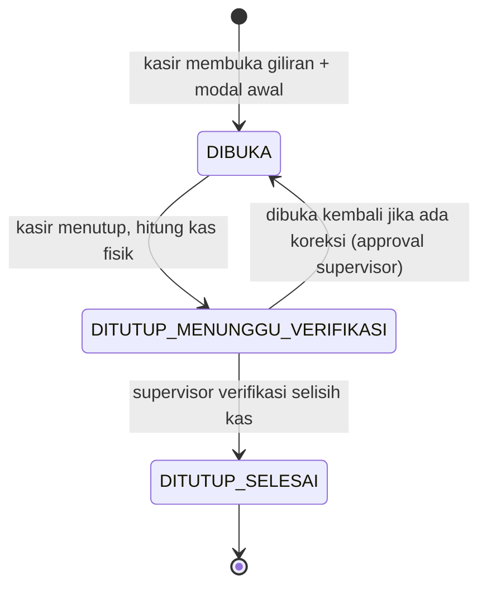
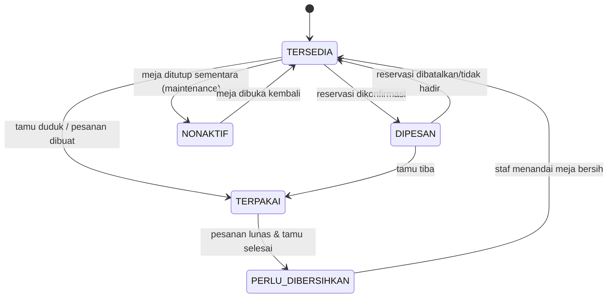
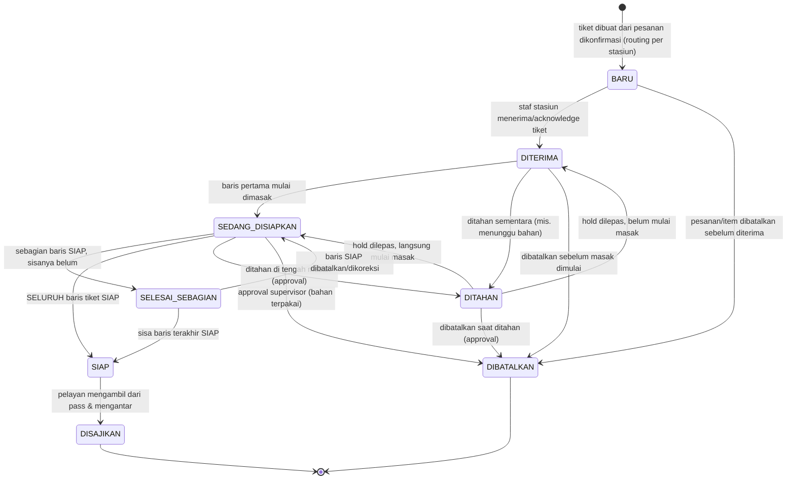
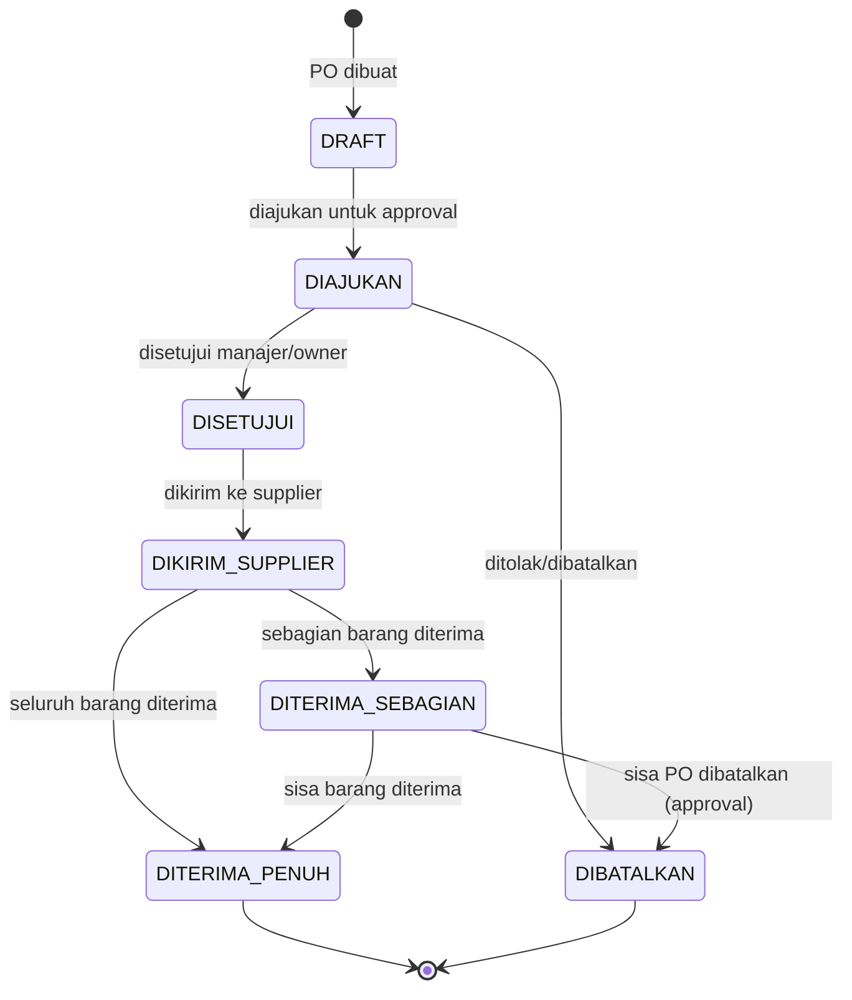
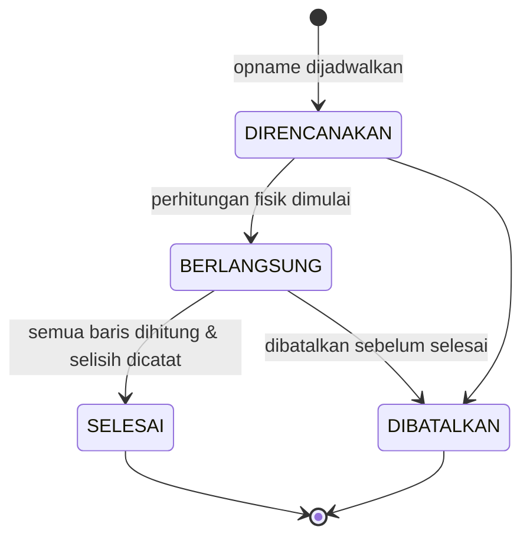

# State Machine Inti Altora Resto

Tujuh state machine inti yang menjadi tulang punggung alur operasional restoran.

## 1. Pesanan

**ALT-DEF-005 (correction-loop lanjutan):** diagram dan tabel di bawah
menggantikan diagram lama 7-status (BARU/DIKONFIRMASI/DIPROSES_DAPUR/
SIAP_DISAJIKAN/DISAJIKAN/DIBAYAR/DIBATALKAN). Lihat ADR-017 di
`docs/engineering/DECISION-LOG.md` untuk rasional desain lengkap dan
keputusan yang diambil untuk setiap ambiguitas.

Catatan penting yang TIDAK terlihat langsung di diagram (lihat tabel penuh
di bawah untuk detail per baris):

- `DIBATALKAN` **TIDAK** dapat dicapai dari `SIAP`/`DISAJIKAN`/`SELESAI` -
  begitu makanan siap/disajikan, jalur yang benar adalah `DIRETUR` (setelah
  `SELESAI`) atau pembatalan level-item (`ItemPesanan.status = DIBATALKAN`).
- `DIRETUR` **HANYA** dapat dicapai dari `SELESAI`.
- Cabang `DIKIRIM -> MENUNGGU_PERSETUJUAN` vs `DIKIRIM -> DITERIMA` dan
  `DITERIMA -> MENUNGGU_PEMBAYARAN` vs `DITERIMA -> DIKONFIRMASI` adalah
  transisi **otomatis oleh sistem** berdasarkan guard (`kanal`/kebijakan
  prepaid tenant), bukan pilihan manual staf.

### Tabel transisi lengkap

| statusAsal | statusTujuan | aktorDiizinkan | guard | sideEffect | auditEvent | testRequired |
|---|---|---|---|---|---|---|
| DRAF | DIKIRIM | PELAYAN/KASIR (izin `pesanan.buat`) atau publik via token QR meja aktif (`ALT-MJ-009`), tanpa `izin.kode` | Pesanan punya minimal 1 `ItemPesanan`; untuk kanal `QR_PELANGGAN`, `SesiMejaQr` masih aktif (belum `ditutupPada`) | Tidak ada efek samping lain (murni transisi status) | `order.submitted` | `pesanan_transisi_draf_ke_dikirim_valid` |
| DIKIRIM | MENUNGGU_PERSETUJUAN | sistem (otomatis) | `kanal == QR_PELANGGAN` | Notifikasi in-app ke staf kasir/pelayan outlet (`Notification.tipe = PESANAN_QR_MASUK`) | `order.submitted` (payload menyertakan status baru) | `pesanan_qr_masuk_menunggu_persetujuan` |
| DIKIRIM | DITERIMA | sistem (otomatis) | `kanal IN (KASIR, PELAYAN)` | Tidak ada efek samping tambahan | `order.accepted` | `pesanan_staf_auto_diterima` |
| MENUNGGU_PERSETUJUAN | DITERIMA | KASIR/PELAYAN/MANAJER (izin `pesanan.terima`) | Pesanan belum kadaluarsa (mis. sesi QR meja masih aktif) | Tidak ada efek samping tambahan | `order.accepted` | `pesanan_qr_disetujui_staf` |
| MENUNGGU_PERSETUJUAN | DITOLAK | KASIR/PELAYAN/MANAJER (izin `pesanan.tolak`) | `alasan` wajib diisi (non-empty) | Tulis 1 baris `PesananPenolakan` (`alasan`, `ditolakOlehId`) | `order.rejected` | `pesanan_qr_ditolak_staf_dengan_alasan` |
| DITOLAK | DIKIRIM | Pemesan asli (pelanggan via token QR, atau pelayan yang mengoreksi) | Sesi/token QR meja masih aktif (kanal `QR_PELANGGAN`); pesanan diedit dulu (lihat `PesananPerubahan`) sebelum dikirim ulang | Tidak menghapus baris `Pesanan`/`PesananPenolakan` lama (lihat ADR-017 Keputusan 3, TODO batch berikutnya) | `order.submitted` | `pesanan_ditolak_dikirim_ulang_retry` |
| DITERIMA | MENUNGGU_PEMBAYARAN | sistem (otomatis) | Kebijakan tenant `wajibBayarDimuka = true` (mis. QR self-order tanpa staf pengawas) | Buat baris `Pembayaran` berstatus `MENUNGGU` | `payment.awaiting_confirmation` | `pesanan_prepaid_menunggu_pembayaran` |
| DITERIMA | DIKONFIRMASI | sistem (otomatis) | Kebijakan tenant `wajibBayarDimuka = false`, ATAU `kanal IN (KASIR, PELAYAN)` (bayar di akhir) | Tidak ada efek samping tambahan | `order.updated` | `pesanan_tanpa_prepaid_langsung_konfirmasi` |
| MENUNGGU_PEMBAYARAN | DIKONFIRMASI | KASIR (verifikasi pembayaran, izin `pembayaran.buat`) | `Pembayaran` terkait berstatus `DIKONFIRMASI` dan `totalDibayar >= totalAkhir` (atau sesuai kebijakan DP tenant) | Update baris `Pembayaran` menjadi `DIKONFIRMASI` | `payment.confirmed` | `pesanan_prepaid_lunas_dikonfirmasi` |
| MENUNGGU_PEMBAYARAN | DIBATALKAN | sistem (batas waktu bayar terlampaui) atau pelanggan (batalkan sendiri) | Batas waktu pembayaran (kebijakan tenant) terlampaui TANPA pembayaran masuk | Tulis 1 baris `PesananPembatalan` (`alasan = "Batas waktu pembayaran dimuka terlampaui"` atau alasan pelanggan) | `order.cancelled` | `pesanan_prepaid_timeout_dibatalkan` |
| DIKONFIRMASI | DIKIRIM_KE_DAPUR | sistem/KASIR/PELAYAN (izin `pesanan.status.ubah`) | Seluruh `ItemPesanan` berstatus valid untuk dikirim (bukan `DIBATALKAN`/`DIRETUR`) | Buat **satu atau lebih** `TiketDapur` - satu per stasiun tujuan per gelombang, sesuai `AturanRoutingDapur` (kardinalitas 1:N sejak ALT-DEF-006/ADR-018, lihat bagian 5); reservasi/pengurangan stok bahan sesuai resep bila berlaku | `order.sent_to_kitchen` | `pesanan_dikonfirmasi_kirim_ke_dapur` |
| DIKIRIM_KE_DAPUR | SEDANG_DISIAPKAN | DAPUR (event internal `TiketDapur.status = SEDANG_DISIAPKAN`, lihat bagian 5) | Minimal 1 `TiketDapur` milik pesanan ini masuk `SEDANG_DISIAPKAN` (minimal 1 baris `TiketDapurBaris` mulai dimasak) | Tidak ada efek samping tambahan di level Pesanan (state dapur granular ada di `TiketDapur`) | `kitchen.started` | `pesanan_dapur_mulai_diproses` |
| SEDANG_DISIAPKAN | SIAP | DAPUR (event internal `TiketDapur.status = SIAP`) | **SELURUH** `TiketDapur` milik pesanan ini berstatus `SIAP`/`DISAJIKAN` (masing-masing tiket sendiri baru `SIAP` bila seluruh `TiketDapurBaris`-nya `SIAP`) - agregat lintas-stasiun sejak ALT-DEF-006/ADR-018 | Notifikasi in-app ke pelayan (`Notification.tipe = PESANAN_SIAP`) | `kitchen.ready` | `pesanan_seluruh_tiket_dapur_siap` |
| SIAP | DISAJIKAN | PELAYAN (izin `pesanan.status.ubah`) | - | Update `Meja.status` terkait jika relevan (di luar scope perubahan skema batch ini) | `order.served` | `pesanan_disajikan_ke_meja` |
| DISAJIKAN | SELESAI | KASIR (verifikasi pelunasan, izin `pembayaran.buat`/`pesanan.status.ubah`) | Total `Pembayaran` yang `DIKONFIRMASI` untuk pesanan ini `>= totalAkhir` | Tidak ada efek samping tambahan (pelunasan sudah tercatat di `Pembayaran`) | `order.completed` | `pesanan_lunas_selesai` |
| SELESAI | DIRETUR | KASIR/MANAJER (izin `pesanan.retur.kelola`), butuh approval supervisor | Dalam batas waktu kebijakan retur tenant; model detail `PesananRetur` adalah scope `ALT-PES-018`/`ALT-DEF-014` (batch berikutnya) | Di luar scope batch ini (lihat `ALT-DEF-014`) | `order.returned` | `pesanan_retur_setelah_selesai` (batch berikutnya) |
| DRAF | DIBATALKAN | Pemesan asli / KASIR/PELAYAN (izin `pesanan.batalkan`) | - | Tulis 1 baris `PesananPembatalan` | `order.cancelled` | `pesanan_draf_dibatalkan` |
| DIKIRIM | DIBATALKAN | KASIR/PELAYAN (izin `pesanan.batalkan`) | - | Tulis 1 baris `PesananPembatalan` | `order.cancelled` | `pesanan_dikirim_dibatalkan` |
| MENUNGGU_PERSETUJUAN | DIBATALKAN | KASIR/PELAYAN (izin `pesanan.batalkan`) | Dibatalkan sebelum sempat diputuskan terima/tolak | Tulis 1 baris `PesananPembatalan` | `order.cancelled` | `pesanan_menunggu_persetujuan_dibatalkan` |
| DITERIMA | DIBATALKAN | KASIR/PELAYAN (izin `pesanan.batalkan`) | - | Tulis 1 baris `PesananPembatalan` | `order.cancelled` | `pesanan_diterima_dibatalkan` |
| MENUNGGU_PEMBAYARAN | DIBATALKAN | KASIR/PELAYAN/pelanggan (izin `pesanan.batalkan` atau self-cancel) | - | Tulis 1 baris `PesananPembatalan` | `order.cancelled` | `pesanan_menunggu_pembayaran_dibatalkan_manual` |
| DIKONFIRMASI | DIBATALKAN | SUPERVISOR ke atas (izin `pesanan.batalkan`, `BatasIzin.wajibPersetujuanManajer`) | Approval supervisor wajib (mis. stok habis ditemukan setelah konfirmasi) | Tulis 1 baris `PesananPembatalan` (`dibatalkanOlehId` = supervisor penyetuju) | `order.cancelled` | `pesanan_dikonfirmasi_dibatalkan_approval` |
| DIKIRIM_KE_DAPUR | DIBATALKAN | SUPERVISOR ke atas (izin `pesanan.batalkan`, wajib approval) | Approval supervisor wajib; bahan mungkin sudah mulai terpakai | Tulis 1 baris `PesananPembatalan`; mutasi stok pembalik (`MutasiStok.jenis = RETUR`) bila bahan sudah dipakai | `order.cancelled` | `pesanan_kirim_dapur_dibatalkan_approval_dgn_pembalik_stok` |
| SEDANG_DISIAPKAN | DIBATALKAN | SUPERVISOR ke atas (izin `pesanan.batalkan`, wajib approval) | Approval supervisor wajib; bahan sudah terpakai | Tulis 1 baris `PesananPembatalan`; mutasi stok pembalik sebagian sesuai progres masak | `order.cancelled` | `pesanan_sedang_disiapkan_dibatalkan_approval_dgn_pembalik_stok` |

Catatan tambahan (bukan transisi status, tetapi bagian dari alur `ALT-PES-010`):

- **Perubahan pesanan pasca-DIKONFIRMASI** (tambah item/ubah kuantitas/pindah
  meja/split/merge) dicatat sebagai baris baru di `PesananPerubahan`
  (`jenisPerubahan` enum, `sebelum`/`sesudah` snapshot Json) - TIDAK
  mengubah `StatusPesanan` secara langsung, dan tidak menimpa `ItemPesanan`
  secara diam-diam. `auditEvent`: `order.updated`. `testRequired`:
  `pesanan_perubahan_tercatat_sebagai_baris_baru`.

## 2. Pembayaran

## 3. Giliran Kasir (Shift)

## 4. Meja

## 5. Dapur (Tiket Dapur)

**ALT-DEF-006 (correction-loop lanjutan):** diagram dan tabel di bawah
menggantikan diagram lama 4-status (`MASUK_ANTRIAN`/`DIPROSES`/`SIAP`/
`DIAMBIL_PELAYAN`). Lihat ADR-018 di `docs/engineering/DECISION-LOG.md`
untuk rasional desain lengkap (termasuk mengapa `StatusMasakBaris` tetap
enum terpisah, Keputusan 6).

**Kardinalitas penting:** satu `Pesanan` kini menghasilkan **banyak**
`TiketDapur` (satu per stasiun tujuan per gelombang, `@@unique([pesananId,
stasiunDapurId, nomorGelombang])`). State machine di bawah berlaku
**per-tiket**, BUKAN per-pesanan - status `Pesanan` adalah turunan AGREGAT
dari seluruh tiketnya (lihat guard di bagian 1).

Catatan penting yang TIDAK terlihat langsung di diagram:

- `DIBATALKAN` **TIDAK** dapat dicapai dari `SELESAI_SEBAGIAN`/`SIAP`/
  `DISAJIKAN` - begitu ada baris yang sudah matang, jalur yang benar adalah
  pembatalan level-item (`TiketDapurBaris` dikeluarkan) atau retur di level
  `Pesanan` (`SELESAI -> DIRETUR`), konsisten dengan aturan yang sama di
  state machine `Pesanan` (bagian 1).
- `SELESAI_SEBAGIAN` hanya bermakna untuk tiket dengan **lebih dari satu**
  `TiketDapurBaris`; tiket satu-baris melompat langsung
  `SEDANG_DISIAPKAN -> SIAP`.
- `DITAHAN` adalah status **tiket**, bukan baris - `ALT-DPR-007` menyatakan
  tiket `DITAHAN` tidak dihitung dalam SLA waktu masak aktif, sehingga timer
  (`ALT-DPR-005`) berhenti selama hold.
- Setiap transisi di tabel di bawah **wajib** menulis satu baris
  `RiwayatStatusTiketDapur` (`statusSebelumnya`/`statusBaru` bertipe enum,
  `diubahOlehId` nullable untuk event sistem/timer) - ini bukan opsional dan
  tidak diulang di kolom `sideEffect` tiap baris.

### Tabel transisi lengkap

| statusAsal | statusTujuan | aktorDiizinkan | guard | sideEffect | auditEvent | testRequired |
|---|---|---|---|---|---|---|
| (baru) | BARU | sistem (otomatis, saat `Pesanan` masuk `DIKIRIM_KE_DAPUR`) | `Pesanan.status == DIKONFIRMASI` dan minimal 1 `ItemPesanan` ter-routing ke stasiun ini via `AturanRoutingDapur` (`ALT-DPR-002`) | Buat 1 `TiketDapur` per stasiun tujuan + `TiketDapurBaris` untuk tiap `ItemPesanan` yang ter-routing ke stasiun tsb (`ALT-DPR-003`/`ALT-DPR-004`); cetak tiket fisik bila printer stasiun dikonfigurasi (`ALT-DPR-011`, gagal cetak TIDAK menghambat alur data) | `kitchen.ticket_created` | `tiket_dapur_dibuat_satu_per_stasiun_tujuan` |
| BARU | DITERIMA | DAPUR/MANAJER (izin `dapur.tiket.lihat` + acknowledge di layar KDS) | Tiket belum `DIBATALKAN` | Set `mulaiDiprosesPada = null` (belum masak, hanya acknowledge); notifikasi audio KDS berhenti (`ALT-DPR-013`) | `kitchen.ticket_acknowledged` | `tiket_dapur_baru_diterima_staf` |
| BARU | DIBATALKAN | KASIR/PELAYAN/SUPERVISOR (izin `pesanan.batalkan`) | Pesanan induk dibatalkan ATAU seluruh item tiket ini dibatalkan, SEBELUM tiket diterima dapur | Seluruh `TiketDapurBaris` tiket ini ditandai keluar; tidak ada mutasi stok pembalik (bahan belum dipakai) | `kitchen.ticket_cancelled` | `tiket_dapur_baru_dibatalkan_tanpa_pembalik_stok` |
| DITERIMA | SEDANG_DISIAPKAN | DAPUR (izin `dapur.tiket.lihat`) | Minimal 1 `TiketDapurBaris` bertransisi `MENUNGGU -> DIMASAK` | Set `TiketDapur.mulaiDiprosesPada = now()` (start timer `ALT-DPR-005`); emit event ke domain Pesanan -> `Pesanan.status = SEDANG_DISIAPKAN` bila ini tiket pertama pesanan tsb yang mulai | `kitchen.started` | `tiket_dapur_mulai_disiapkan_set_waktu_mulai` |
| DITERIMA | DITAHAN | DAPUR/SUPERVISOR (izin `dapur.tiket.tahan`) | `alasan` hold wajib diisi (mis. bahan habis) | Timer SLA dihentikan (`ALT-DPR-007`: tiket `DITAHAN` tidak dihitung dalam SLA aktif) | `kitchen.ticket_held` | `tiket_dapur_diterima_ditahan_sla_berhenti` |
| DITERIMA | DIBATALKAN | KASIR/PELAYAN/SUPERVISOR (izin `pesanan.batalkan`) | Masak belum dimulai (`mulaiDiprosesPada == null`) | Tidak ada mutasi stok pembalik (bahan belum dipakai) | `kitchen.ticket_cancelled` | `tiket_dapur_diterima_dibatalkan_sebelum_masak` |
| DITAHAN | DITERIMA | DAPUR/SUPERVISOR (izin `dapur.tiket.tahan`) | Hold dilepas dan masak BELUM dimulai (`mulaiDiprosesPada == null`) | Timer SLA dilanjutkan kembali | `kitchen.ticket_released` | `tiket_dapur_hold_dilepas_kembali_diterima` |
| DITAHAN | SEDANG_DISIAPKAN | DAPUR (izin `dapur.tiket.tahan`) | Hold dilepas DAN minimal 1 baris langsung `MENUNGGU -> DIMASAK` | Set `mulaiDiprosesPada = now()` bila masih null; timer SLA dilanjutkan | `kitchen.started` | `tiket_dapur_hold_dilepas_langsung_masak` |
| DITAHAN | DIBATALKAN | SUPERVISOR ke atas (izin `pesanan.batalkan`, `BatasIzin.wajibPersetujuanManajer`) | Approval supervisor wajib | Mutasi stok pembalik (`MutasiStok.jenis = RETUR`) HANYA bila `mulaiDiprosesPada != null` | `kitchen.ticket_cancelled` | `tiket_dapur_ditahan_dibatalkan_approval` |
| SEDANG_DISIAPKAN | SELESAI_SEBAGIAN | DAPUR (izin `dapur.baris.siap`) | Minimal 1 `TiketDapurBaris` berstatus `SIAP` DAN minimal 1 baris masih `MENUNGGU`/`DIMASAK` (`ALT-DPR-008`) | Tidak ada efek samping di level `Pesanan` (belum siap keseluruhan) | `kitchen.line_ready` | `tiket_dapur_sebagian_baris_siap` |
| SEDANG_DISIAPKAN | SIAP | DAPUR (izin `dapur.tiket.siap`) | **SELURUH** `TiketDapurBaris` milik tiket ini berstatus `SIAP` (`ALT-DPR-009`) | Set `siapPada = now()` (timer berhenti, `ALT-DPR-005`); notifikasi in-app ke pelayan (`Notification.tipe = PESANAN_SIAP`); emit event ke domain Pesanan - `Pesanan.status` menjadi `SIAP` HANYA bila SELURUH tiket pesanan tsb sudah `SIAP`/`DISAJIKAN` | `kitchen.ready` | `tiket_dapur_seluruh_baris_siap_notifikasi_pelayan` |
| SEDANG_DISIAPKAN | DITAHAN | SUPERVISOR (izin `dapur.tiket.tahan`) | `alasan` hold wajib; approval supervisor karena masak sudah berjalan | Timer SLA dihentikan; baris `DIMASAK` tetap `DIMASAK` (tidak di-reset ke `MENUNGGU`) | `kitchen.ticket_held` | `tiket_dapur_ditahan_di_tengah_masak` |
| SEDANG_DISIAPKAN | DIBATALKAN | SUPERVISOR ke atas (izin `pesanan.batalkan`, wajib approval) | Approval supervisor wajib; TIDAK ada baris yang sudah `SIAP` (bila ada, tiket sudah `SELESAI_SEBAGIAN` dan pembatalan tiket penuh terlarang) | Mutasi stok pembalik sebagian (`MutasiStok.jenis = RETUR`) sesuai progres masak | `kitchen.ticket_cancelled` | `tiket_dapur_sedang_disiapkan_dibatalkan_approval_dgn_pembalik_stok` |
| SELESAI_SEBAGIAN | SIAP | DAPUR (izin `dapur.tiket.siap`) | Baris terakhir yang tersisa bertransisi ke `SIAP` - SELURUH baris kini `SIAP` | Set `siapPada = now()`; notifikasi in-app ke pelayan; emit event agregat ke domain Pesanan (lihat baris `SEDANG_DISIAPKAN -> SIAP`) | `kitchen.ready` | `tiket_dapur_selesai_sebagian_jadi_siap` |
| SELESAI_SEBAGIAN | SEDANG_DISIAPKAN | DAPUR/SUPERVISOR (izin `dapur.baris.siap`) | Koreksi: baris yang tadinya ditandai `SIAP` dikembalikan ke `DIMASAK` (salah tandai) - kini TIDAK ada lagi baris `SIAP` | Tidak ada efek samping tambahan; koreksi baris tercatat di `RiwayatStatusTiketDapur` seperti transisi lain | `kitchen.line_ready` (payload koreksi) | `tiket_dapur_koreksi_baris_salah_tandai_siap` |
| SIAP | DISAJIKAN | PELAYAN/DAPUR (izin `dapur.tiket.ambil`) | Tiket berstatus `SIAP` (`ALT-DPR-010`) | Emit event ke domain Pesanan - `Pesanan.status` menjadi `DISAJIKAN` HANYA bila SELURUH tiket pesanan tsb sudah `DISAJIKAN` | `kitchen.served` | `tiket_dapur_diambil_pelayan_disajikan` |

Catatan tambahan (bukan transisi status `TiketDapur`):

- **`GelombangDapur`** punya siklus hidupnya sendiri
  (`MENUNGGU -> DIPICU -> SELESAI`, enum `StatusGelombangDapur`) yang
  TERPISAH dari status tiap `TiketDapur` di dalamnya: satu gelombang
  menjadi `DIPICU` saat staf menekan "kirim course berikutnya"
  (`dipicuPada`/`dipicuOlehId` terisi), dan `SELESAI` saat SELURUH
  `TiketDapur` dengan `nomorGelombang` tsb berstatus `DISAJIKAN`/
  `DIBATALKAN`. Lihat ADR-018 Keputusan 3.
- **`StatusMasakBaris`** (`MENUNGGU`/`DIMASAK`/`SIAP` di `TiketDapurBaris`)
  adalah enum terpisah dan lebih halus - ia yang menjadi **guard** bagi
  transisi tiket `SEDANG_DISIAPKAN`/`SELESAI_SEBAGIAN`/`SIAP` di atas.
  Alasan tidak digabung: ADR-018 Keputusan 6.

## 6. Pembelian (Purchase Order)

## 7. Opname (Stok Opname)

## Catatan umum

- Semua transisi status wajib dicatat di tabel riwayat/audit terkait (`PESANAN_RIWAYAT_STATUS`, `AUDIT_LOG`, dsb) - lihat `docs/database/`.
- Transisi yang melibatkan pembatalan/koreksi finansial atau stok tidak pernah menghapus data - selalu lewat status baru atau entri pembalik, sesuai aturan no-hard-delete.
- Transisi yang memerlukan approval supervisor (mis. buka ulang giliran kasir, batalkan PO yang sudah diterima sebagian) tunduk pada limit di `docs/keamanan/PERMISSION-MATRIX.md`.
