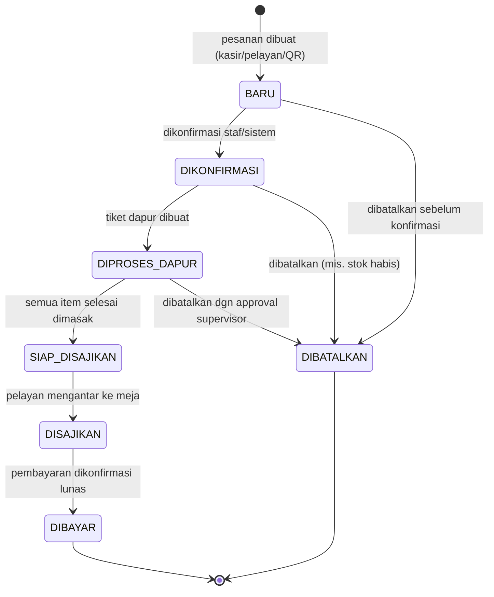
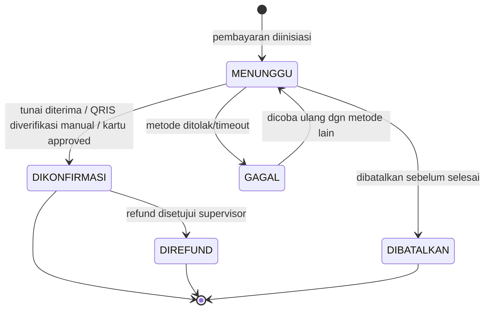
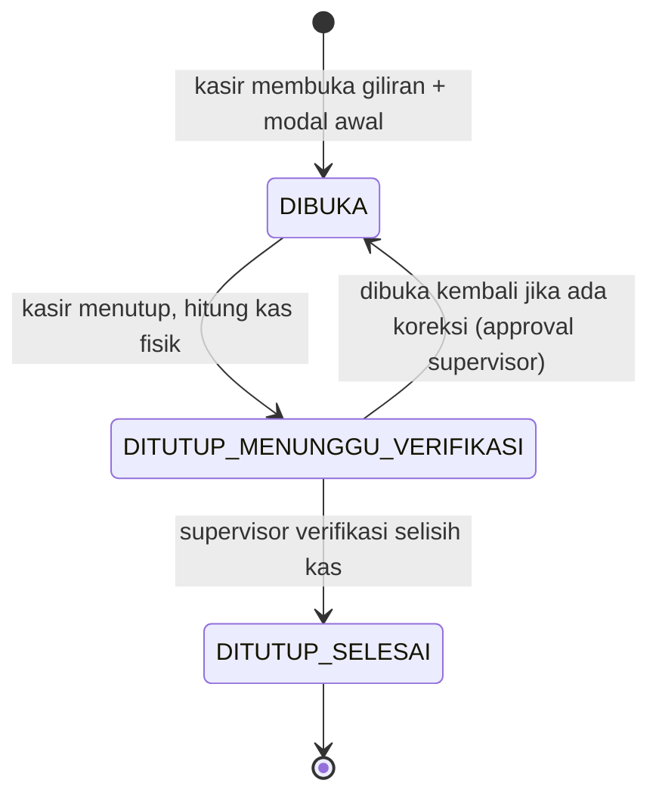
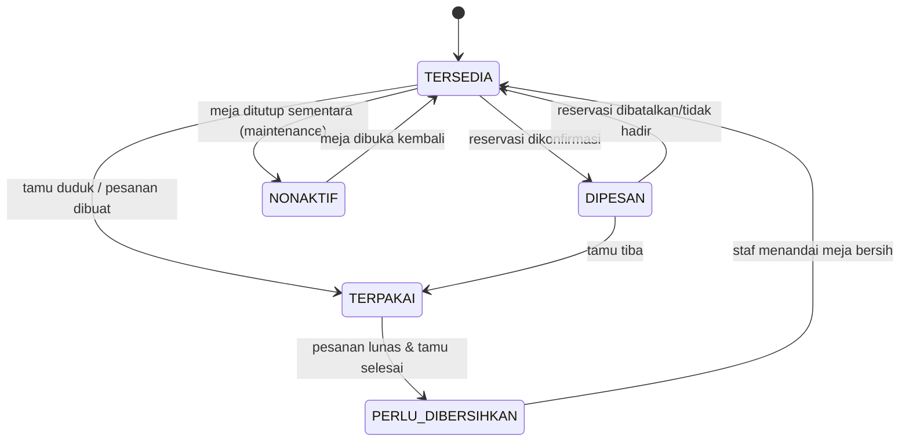
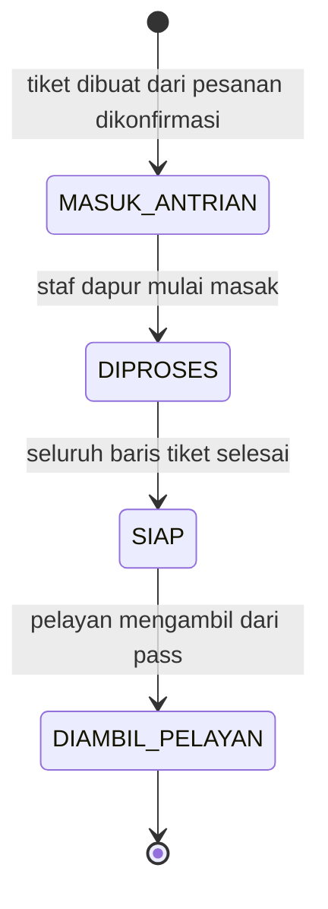
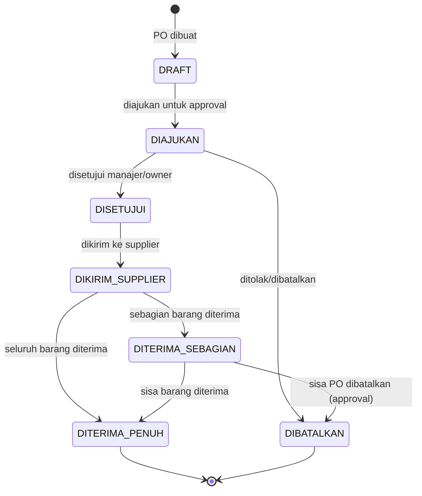
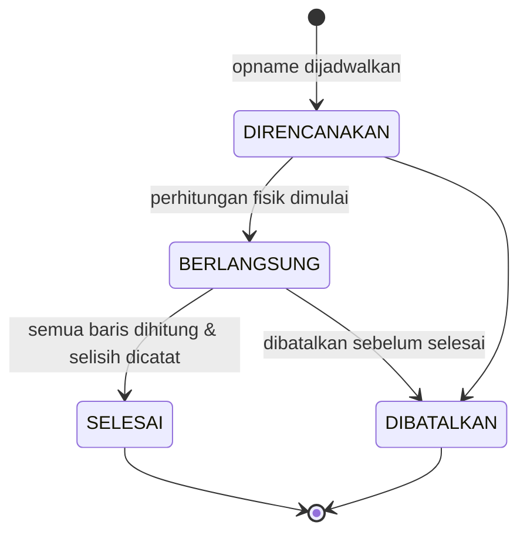

# State Machine Inti Altora Resto

Tujuh state machine inti yang menjadi tulang punggung alur operasional restoran.

## 1. Pesanan

## 2. Pembayaran

## 3. Giliran Kasir (Shift)

## 4. Meja

## 5. Dapur (Tiket Dapur)

## 6. Pembelian (Purchase Order)

## 7. Opname (Stok Opname)

## Catatan umum

- Semua transisi status wajib dicatat di tabel riwayat/audit terkait (`PESANAN_RIWAYAT_STATUS`, `AUDIT_LOG`, dsb) - lihat `docs/database/`.
- Transisi yang melibatkan pembatalan/koreksi finansial atau stok tidak pernah menghapus data - selalu lewat status baru atau entri pembalik, sesuai aturan no-hard-delete.
- Transisi yang memerlukan approval supervisor (mis. buka ulang giliran kasir, batalkan PO yang sudah diterima sebagian) tunduk pada limit di `docs/keamanan/PERMISSION-MATRIX.md`.
