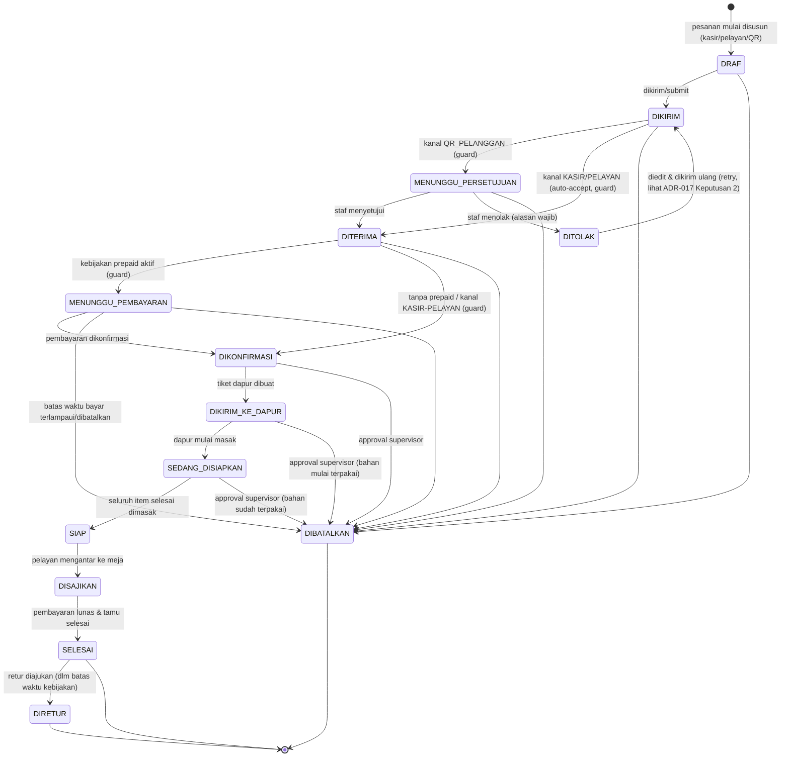
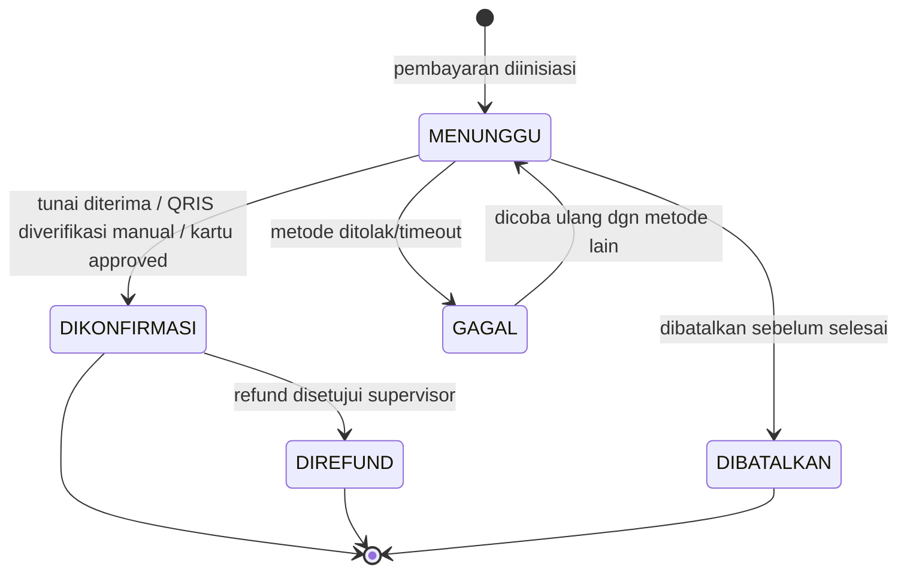
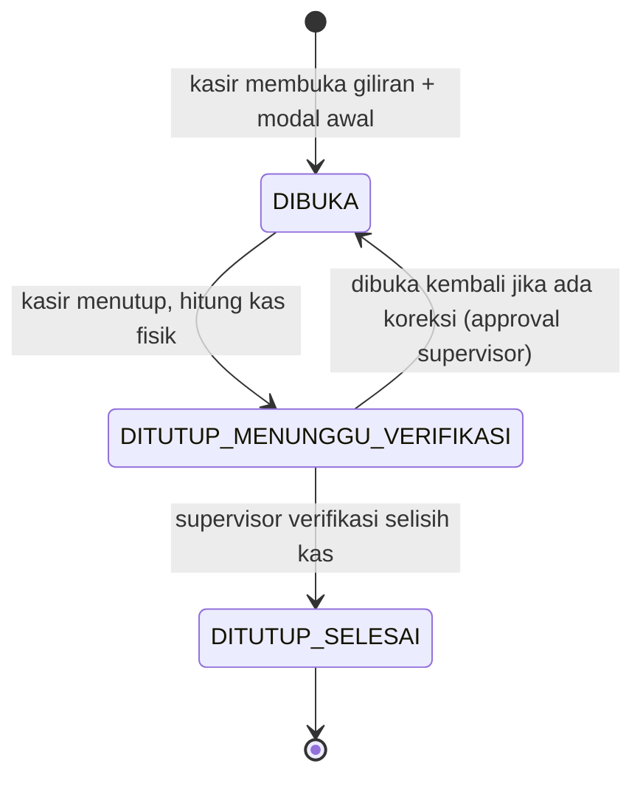
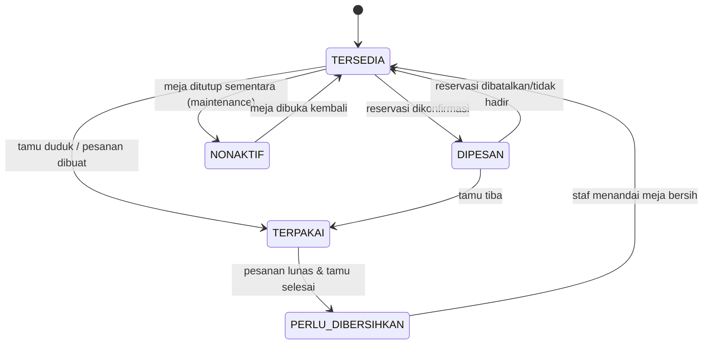
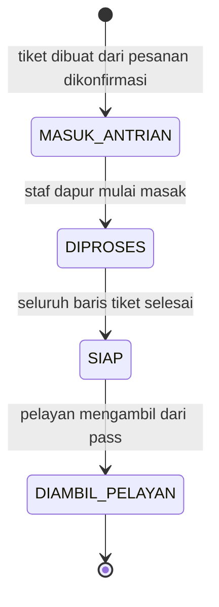
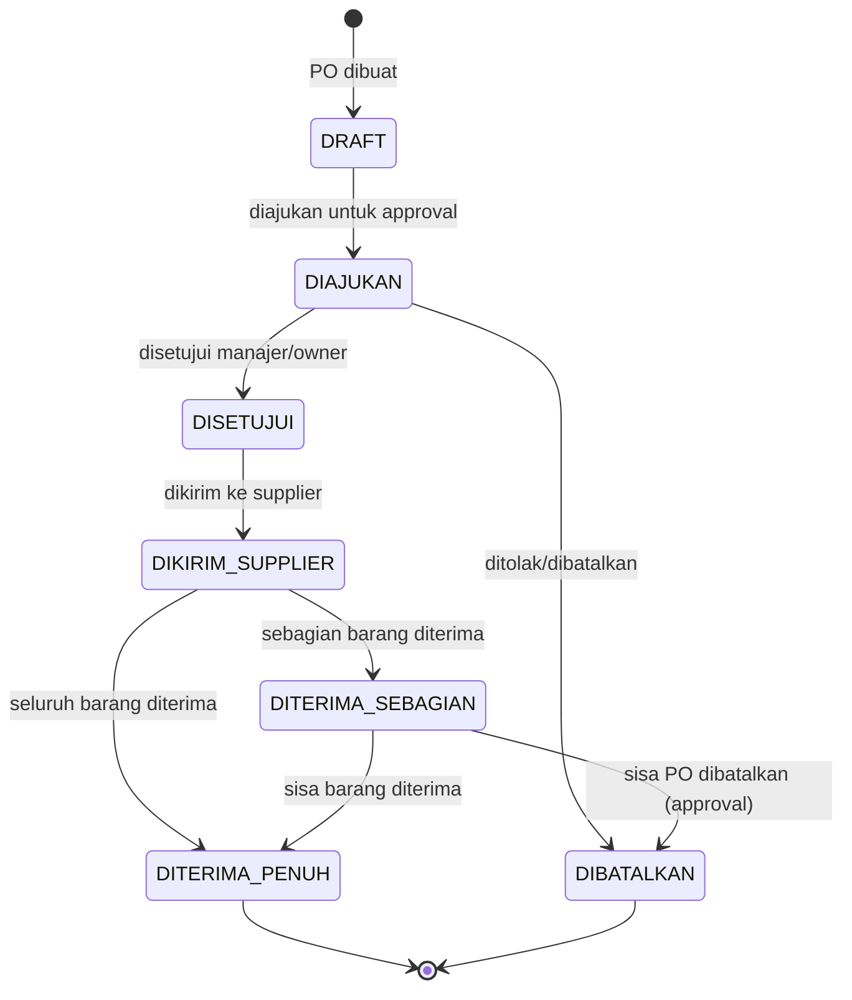
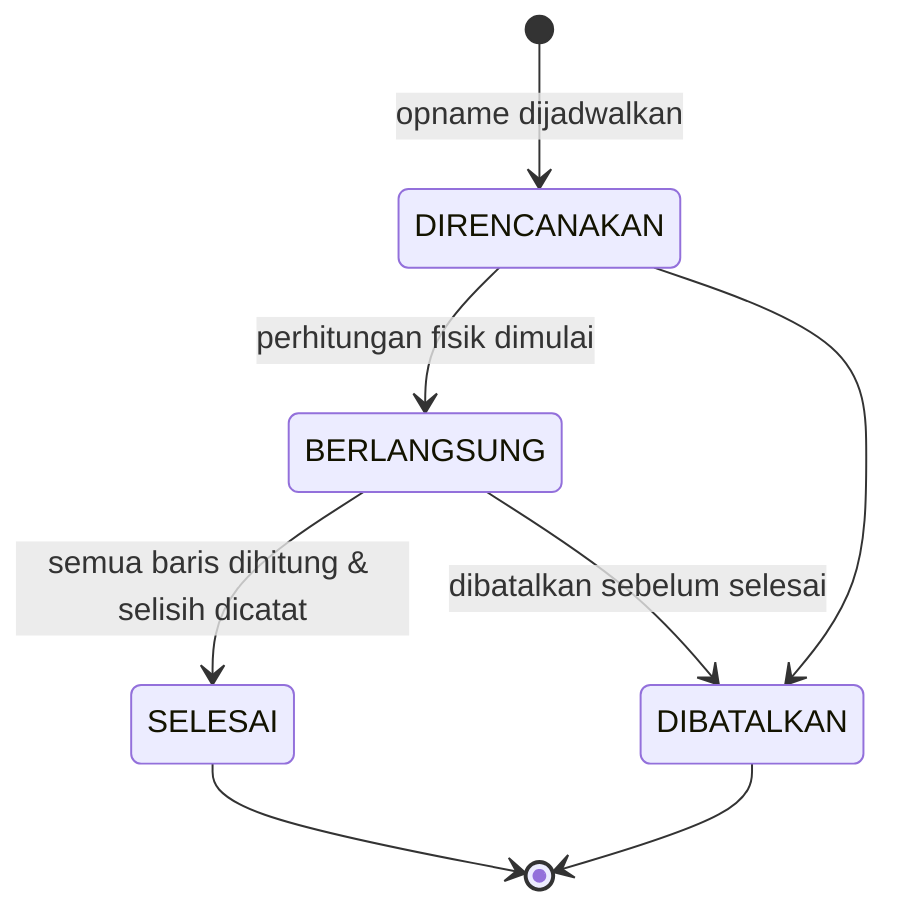

# State Machine Inti Altora Resto

Tujuh state machine inti yang menjadi tulang punggung alur operasional restoran.

## 1. Pesanan

**ALT-DEF-005 (correction-loop lanjutan):** diagram dan tabel di bawah
menggantikan diagram lama 7-status (BARU/DIKONFIRMASI/DIPROSES_DAPUR/
SIAP_DISAJIKAN/DISAJIKAN/DIBAYAR/DIBATALKAN). Lihat ADR-017 di
`docs/engineering/DECISION-LOG.md` untuk rasional desain lengkap dan
keputusan yang diambil untuk setiap ambiguitas.

Catatan penting yang TIDAK terlihat langsung di diagram (lihat tabel penuh
di bawah untuk detail per baris):

- `DIBATALKAN` **TIDAK** dapat dicapai dari `SIAP`/`DISAJIKAN`/`SELESAI` -
  begitu makanan siap/disajikan, jalur yang benar adalah `DIRETUR` (setelah
  `SELESAI`) atau pembatalan level-item (`ItemPesanan.status = DIBATALKAN`).
- `DIRETUR` **HANYA** dapat dicapai dari `SELESAI`.
- Cabang `DIKIRIM -> MENUNGGU_PERSETUJUAN` vs `DIKIRIM -> DITERIMA` dan
  `DITERIMA -> MENUNGGU_PEMBAYARAN` vs `DITERIMA -> DIKONFIRMASI` adalah
  transisi **otomatis oleh sistem** berdasarkan guard (`kanal`/kebijakan
  prepaid tenant), bukan pilihan manual staf.

### Tabel transisi lengkap

| statusAsal | statusTujuan | aktorDiizinkan | guard | sideEffect | auditEvent | testRequired |
|---|---|---|---|---|---|---|
| DRAF | DIKIRIM | PELAYAN/KASIR (izin `pesanan.buat`) atau publik via token QR meja aktif (`ALT-MJ-009`), tanpa `izin.kode` | Pesanan punya minimal 1 `ItemPesanan`; untuk kanal `QR_PELANGGAN`, `SesiMejaQr` masih aktif (belum `ditutupPada`) | Tidak ada efek samping lain (murni transisi status) | `order.submitted` | `pesanan_transisi_draf_ke_dikirim_valid` |
| DIKIRIM | MENUNGGU_PERSETUJUAN | sistem (otomatis) | `kanal == QR_PELANGGAN` | Notifikasi in-app ke staf kasir/pelayan outlet (`Notification.tipe = PESANAN_QR_MASUK`) | `order.submitted` (payload menyertakan status baru) | `pesanan_qr_masuk_menunggu_persetujuan` |
| DIKIRIM | DITERIMA | sistem (otomatis) | `kanal IN (KASIR, PELAYAN)` | Tidak ada efek samping tambahan | `order.accepted` | `pesanan_staf_auto_diterima` |
| MENUNGGU_PERSETUJUAN | DITERIMA | KASIR/PELAYAN/MANAJER (izin `pesanan.terima`) | Pesanan belum kadaluarsa (mis. sesi QR meja masih aktif) | Tidak ada efek samping tambahan | `order.accepted` | `pesanan_qr_disetujui_staf` |
| MENUNGGU_PERSETUJUAN | DITOLAK | KASIR/PELAYAN/MANAJER (izin `pesanan.tolak`) | `alasan` wajib diisi (non-empty) | Tulis 1 baris `PesananPenolakan` (`alasan`, `ditolakOlehId`) | `order.rejected` | `pesanan_qr_ditolak_staf_dengan_alasan` |
| DITOLAK | DIKIRIM | Pemesan asli (pelanggan via token QR, atau pelayan yang mengoreksi) | Sesi/token QR meja masih aktif (kanal `QR_PELANGGAN`); pesanan diedit dulu (lihat `PesananPerubahan`) sebelum dikirim ulang | Tidak menghapus baris `Pesanan`/`PesananPenolakan` lama (lihat ADR-017 Keputusan 3, TODO batch berikutnya) | `order.submitted` | `pesanan_ditolak_dikirim_ulang_retry` |
| DITERIMA | MENUNGGU_PEMBAYARAN | sistem (otomatis) | Kebijakan tenant `wajibBayarDimuka = true` (mis. QR self-order tanpa staf pengawas) | Buat baris `Pembayaran` berstatus `MENUNGGU` | `payment.awaiting_confirmation` | `pesanan_prepaid_menunggu_pembayaran` |
| DITERIMA | DIKONFIRMASI | sistem (otomatis) | Kebijakan tenant `wajibBayarDimuka = false`, ATAU `kanal IN (KASIR, PELAYAN)` (bayar di akhir) | Tidak ada efek samping tambahan | `order.updated` | `pesanan_tanpa_prepaid_langsung_konfirmasi` |
| MENUNGGU_PEMBAYARAN | DIKONFIRMASI | KASIR (verifikasi pembayaran, izin `pembayaran.buat`) | `Pembayaran` terkait berstatus `DIKONFIRMASI` dan `totalDibayar >= totalAkhir` (atau sesuai kebijakan DP tenant) | Update baris `Pembayaran` menjadi `DIKONFIRMASI` | `payment.confirmed` | `pesanan_prepaid_lunas_dikonfirmasi` |
| MENUNGGU_PEMBAYARAN | DIBATALKAN | sistem (batas waktu bayar terlampaui) atau pelanggan (batalkan sendiri) | Batas waktu pembayaran (kebijakan tenant) terlampaui TANPA pembayaran masuk | Tulis 1 baris `PesananPembatalan` (`alasan = "Batas waktu pembayaran dimuka terlampaui"` atau alasan pelanggan) | `order.cancelled` | `pesanan_prepaid_timeout_dibatalkan` |
| DIKONFIRMASI | DIKIRIM_KE_DAPUR | sistem/KASIR/PELAYAN (izin `pesanan.status.ubah`) | Seluruh `ItemPesanan` berstatus valid untuk dikirim (bukan `DIBATALKAN`/`DIRETUR`) | Buat `TiketDapur` (kardinalitas 1:1 dipertahankan pada batch ini, lihat `ALT-DEF-006`); reservasi/pengurangan stok bahan sesuai resep bila berlaku | `order.sent_to_kitchen` | `pesanan_dikonfirmasi_kirim_ke_dapur` |
| DIKIRIM_KE_DAPUR | SEDANG_DISIAPKAN | DAPUR (event internal `TiketDapur.status = DIPROSES`, lihat `ALT-DEF-006`) | Minimal 1 baris `TiketDapurBaris` mulai dimasak | Tidak ada efek samping tambahan di level Pesanan (state dapur granular ada di `TiketDapur`) | `kitchen.started` | `pesanan_dapur_mulai_diproses` |
| SEDANG_DISIAPKAN | SIAP | DAPUR (event internal `TiketDapur.status = SIAP`) | Seluruh `TiketDapurBaris` milik tiket ini berstatus `SIAP` | Notifikasi in-app ke pelayan (`Notification.tipe = PESANAN_SIAP`) | `kitchen.ready` | `pesanan_seluruh_item_siap` |
| SIAP | DISAJIKAN | PELAYAN (izin `pesanan.status.ubah`) | - | Update `Meja.status` terkait jika relevan (di luar scope perubahan skema batch ini) | `order.served` | `pesanan_disajikan_ke_meja` |
| DISAJIKAN | SELESAI | KASIR (verifikasi pelunasan, izin `pembayaran.buat`/`pesanan.status.ubah`) | Total `Pembayaran` yang `DIKONFIRMASI` untuk pesanan ini `>= totalAkhir` | Tidak ada efek samping tambahan (pelunasan sudah tercatat di `Pembayaran`) | `order.completed` | `pesanan_lunas_selesai` |
| SELESAI | DIRETUR | KASIR/MANAJER (izin `pesanan.retur.kelola`), butuh approval supervisor | Dalam batas waktu kebijakan retur tenant; model detail `PesananRetur` adalah scope `ALT-PES-018`/`ALT-DEF-014` (batch berikutnya) | Di luar scope batch ini (lihat `ALT-DEF-014`) | `order.returned` | `pesanan_retur_setelah_selesai` (batch berikutnya) |
| DRAF | DIBATALKAN | Pemesan asli / KASIR/PELAYAN (izin `pesanan.batalkan`) | - | Tulis 1 baris `PesananPembatalan` | `order.cancelled` | `pesanan_draf_dibatalkan` |
| DIKIRIM | DIBATALKAN | KASIR/PELAYAN (izin `pesanan.batalkan`) | - | Tulis 1 baris `PesananPembatalan` | `order.cancelled` | `pesanan_dikirim_dibatalkan` |
| MENUNGGU_PERSETUJUAN | DIBATALKAN | KASIR/PELAYAN (izin `pesanan.batalkan`) | Dibatalkan sebelum sempat diputuskan terima/tolak | Tulis 1 baris `PesananPembatalan` | `order.cancelled` | `pesanan_menunggu_persetujuan_dibatalkan` |
| DITERIMA | DIBATALKAN | KASIR/PELAYAN (izin `pesanan.batalkan`) | - | Tulis 1 baris `PesananPembatalan` | `order.cancelled` | `pesanan_diterima_dibatalkan` |
| MENUNGGU_PEMBAYARAN | DIBATALKAN | KASIR/PELAYAN/pelanggan (izin `pesanan.batalkan` atau self-cancel) | - | Tulis 1 baris `PesananPembatalan` | `order.cancelled` | `pesanan_menunggu_pembayaran_dibatalkan_manual` |
| DIKONFIRMASI | DIBATALKAN | SUPERVISOR ke atas (izin `pesanan.batalkan`, `BatasIzin.wajibPersetujuanManajer`) | Approval supervisor wajib (mis. stok habis ditemukan setelah konfirmasi) | Tulis 1 baris `PesananPembatalan` (`dibatalkanOlehId` = supervisor penyetuju) | `order.cancelled` | `pesanan_dikonfirmasi_dibatalkan_approval` |
| DIKIRIM_KE_DAPUR | DIBATALKAN | SUPERVISOR ke atas (izin `pesanan.batalkan`, wajib approval) | Approval supervisor wajib; bahan mungkin sudah mulai terpakai | Tulis 1 baris `PesananPembatalan`; mutasi stok pembalik (`MutasiStok.jenis = RETUR`) bila bahan sudah dipakai | `order.cancelled` | `pesanan_kirim_dapur_dibatalkan_approval_dgn_pembalik_stok` |
| SEDANG_DISIAPKAN | DIBATALKAN | SUPERVISOR ke atas (izin `pesanan.batalkan`, wajib approval) | Approval supervisor wajib; bahan sudah terpakai | Tulis 1 baris `PesananPembatalan`; mutasi stok pembalik sebagian sesuai progres masak | `order.cancelled` | `pesanan_sedang_disiapkan_dibatalkan_approval_dgn_pembalik_stok` |

Catatan tambahan (bukan transisi status, tetapi bagian dari alur `ALT-PES-010`):

- **Perubahan pesanan pasca-DIKONFIRMASI** (tambah item/ubah kuantitas/pindah
  meja/split/merge) dicatat sebagai baris baru di `PesananPerubahan`
  (`jenisPerubahan` enum, `sebelum`/`sesudah` snapshot Json) - TIDAK
  mengubah `StatusPesanan` secara langsung, dan tidak menimpa `ItemPesanan`
  secara diam-diam. `auditEvent`: `order.updated`. `testRequired`:
  `pesanan_perubahan_tercatat_sebagai_baris_baru`.

## 2. Pembayaran

## 3. Giliran Kasir (Shift)

## 4. Meja

## 5. Dapur (Tiket Dapur)

## 6. Pembelian (Purchase Order)

## 7. Opname (Stok Opname)

## Catatan umum

- Semua transisi status wajib dicatat di tabel riwayat/audit terkait (`PESANAN_RIWAYAT_STATUS`, `AUDIT_LOG`, dsb) - lihat `docs/database/`.
- Transisi yang melibatkan pembatalan/koreksi finansial atau stok tidak pernah menghapus data - selalu lewat status baru atau entri pembalik, sesuai aturan no-hard-delete.
- Transisi yang memerlukan approval supervisor (mis. buka ulang giliran kasir, batalkan PO yang sudah diterima sebagian) tunduk pada limit di `docs/keamanan/PERMISSION-MATRIX.md`.
