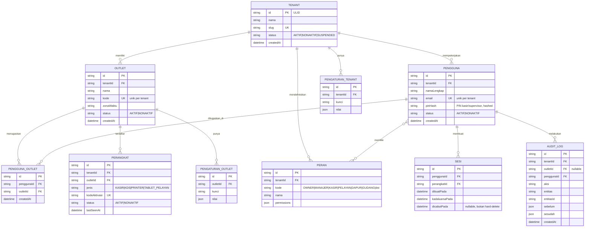

# ERD - Platform (Tenant, Outlet, Pengguna, Perangkat)

Catatan:

- `PERAN.permissions` mengacu ke daftar permission pada `docs/keamanan/PERMISSION-MATRIX.md`.
- `SESI` tidak pernah di-hard-delete; pencabutan sesi memakai `dicabutPada`.
- `AUDIT_LOG` bersifat append-only, sumber kebenaran untuk jejak audit semua domain lain.
