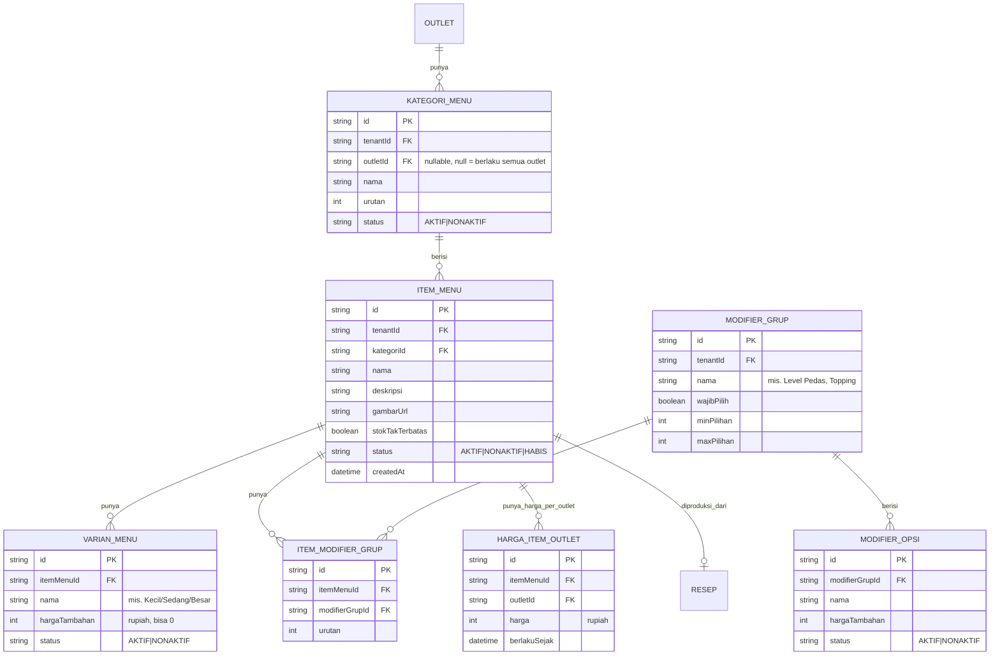

# ERD - Menu & Katalog

Catatan:

- Harga dasar ada di `HARGA_ITEM_OUTLET` per outlet (bukan kolom harga tunggal di `ITEM_MENU`) supaya harga bisa berbeda per outlet dalam satu tenant.
- Relasi ke `RESEP` bersifat opsional (item menu tanpa resep = tidak memotong stok otomatis).
