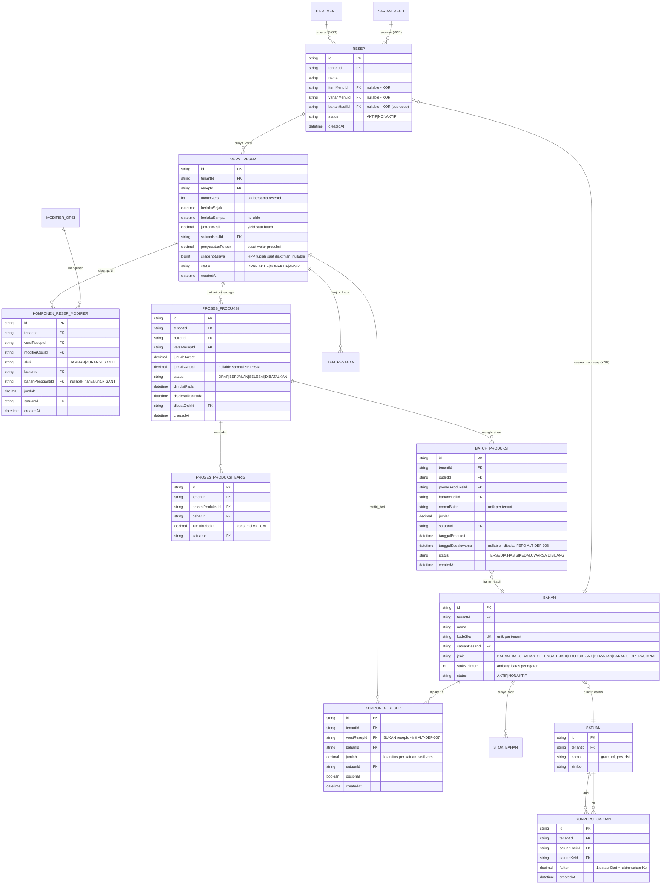

# ERD - Resep & Bahan (BOM), Versi Resep & Produksi

> **Diperbarui pada batch ALT-DEF-007 (lihat ADR-022 di
> `docs/engineering/DECISION-LOG.md`).** Model `RESEP_BAHAN` **DIHAPUS** dan
> digantikan `KOMPONEN_RESEP` yang menggantung pada `VERSI_RESEP`, bukan pada
> `RESEP`. `RESEP` bukan lagi 1:1 dengan `ITEM_MENU`.

Catatan:

- `KOMPONEN_RESEP.jumlah` (dan seluruh kolom kuantitas bahan di domain ini)
  memakai `Decimal` (bukan Int/BigInt) karena satuan bahan baku (gram/ml)
  butuh presisi pecahan - berbeda dari nilai uang. Satu-satunya kolom uang di
  domain ini adalah `VERSI_RESEP.snapshotBiaya`, yang bertipe `BigInt` sejak
  ADR-034 (mengamandemen ADR-005 - awalnya `Int`, field ini sempat terlewat
  dari audit awal batch ADR-034 karena nama field tidak memuat kata kunci
  uang generik, ditemukan lewat regresi test arsitektur, lihat ADR-034
  Keputusan 1).
- **ALT-DEF-007 / ADR-022 Keputusan 4 - `RESEP_BAHAN` DIHAPUS.** Model lama
  `RESEP_BAHAN(resepId, bahanId, jumlah, satuanId)` sudah tidak ada di
  `schema.prisma`. Penggantinya `KOMPONEN_RESEP` menggantung pada
  `versiResepId`, **bukan** `resepId` - inilah seluruh inti perbaikan defect
  ini. Kalau komposisi tetap menggantung pada `RESEP`, mengubah resep tetap akan
  menulis ulang HPP transaksi lampau dan `VERSI_RESEP` hanya jadi tabel
  metadata dekoratif. Penghapusan aman: belum ada migrasi yang pernah
  dijalankan, sehingga belum ada satu baris data pun (`ALT-DEF-029`).
- **Invariant XOR `RESEP`:** tepat satu dari `itemMenuId`/`varianMenuId`/
  `bahanHasilId` boleh non-null. Prisma tidak dapat mengekspresikan ini;
  penegaknya adalah CHECK constraint di
  `prisma/migrations/manual/002_resep_target_xor_check.sql` yang **belum pernah
  dieksekusi** - sampai migrasi nyata berjalan, invariant ini HANYA dijaga
  guard level-aplikasi.
- **Invariant "satu versi AKTIF per resep":** ditegakkan partial unique index di
  `prisma/migrations/manual/003_versi_resep_satu_aktif.sql` (`WHERE status =
  'AKTIF'`), pola yang sama dengan konfigurasi QRIS (ADR-021 Keputusan 3).
  `@@unique([resepId, status])` sengaja TIDAK dipakai karena akan melarang satu
  resep punya banyak versi `NONAKTIF`, padahal riwayat versi yang menumpuk
  adalah alasan keberadaan model ini. File SQL tersebut juga **belum pernah
  dieksekusi**.
- **Subresep tanpa model `Subresep`:** sebuah `BAHAN` berjenis
  `BAHAN_SETENGAH_JADI` adalah hasil satu resep (`RESEP.bahanHasilId`) sekaligus
  input resep lain (`KOMPONEN_RESEP.bahanId`). Lihat ADR-022 Keputusan 1 untuk
  alasan model `Subresep` terpisah ditolak.
- **Snapshot histori:** `ITEM_PESANAN.resepVersiId` kini FK sungguhan ke
  `VERSI_RESEP` (sebelumnya scalar polos tanpa relasi - lihat ADR-017 Keputusan
  8 dan ADR-022 Keputusan 7). Satu baris pesanan permanen menunjuk versi resep
  persis yang dipakai saat transaksi.
- Pemotongan stok otomatis saat pesanan selesai dihitung dari `KOMPONEN_RESEP`
  **versi yang tercatat di baris pesanan** dikalikan kuantitas item, lalu
  dicatat sebagai baris baru di `MUTASI_STOK` (lihat `04-persediaan.md`) - bukan
  mengubah `STOK_BAHAN` secara langsung tanpa jejak, dan bukan memakai versi
  aktif saat ini. **Belum diimplementasikan** - itu teritori `ALT-DEF-008`
  (persediaan), lihat ADR-022 Keputusan 8 untuk kontrak serah-terimanya.
- **ALT-DEF-010 (lihat ADR-013):** `BAHAN` punya `@@unique([tenantId, id])` agar
  model lain bisa memakai composite-FK menuju `Bahan`. Pada batch ALT-DEF-007
  `SATUAN` mendapat `@@unique([tenantId, id])` dengan alasan yang sama, dan
  seluruh model baru di domain ini memakai composite-FK
  `(tenantId, xId) -> X(tenantId, id)`.
- **Lubang tenant-safety yang diketahui (`ALT-DEF-035`):** `RESEP.varianMenuId`
  dan `KOMPONEN_RESEP_MODIFIER.modifierOpsiId` **terpaksa** memakai FK ID
  tunggal karena `VarianMenu` dan `ModifierOpsi` tidak membawa `tenantId` sama
  sekali (keduanya di luar audit ADR-013). Dicatat sebagai defect terpisah di
  `DEFECT-LEDGER.md`, bukan dilewati diam-diam.
- **ADR-033:** `ProsesProduksi.dibuatOlehId` dipindah dari FK langsung ke `Pengguna` menjadi composite-FK OUTLET-LEVEL `(tenantId, outletId, dibuatOlehId) -> KeanggotaanOutlet(tenantId, outletId, id)` - lihat `docs/engineering/DECISION-LOG.md` ADR-033 untuk audit lengkap seluruh field aktor.
