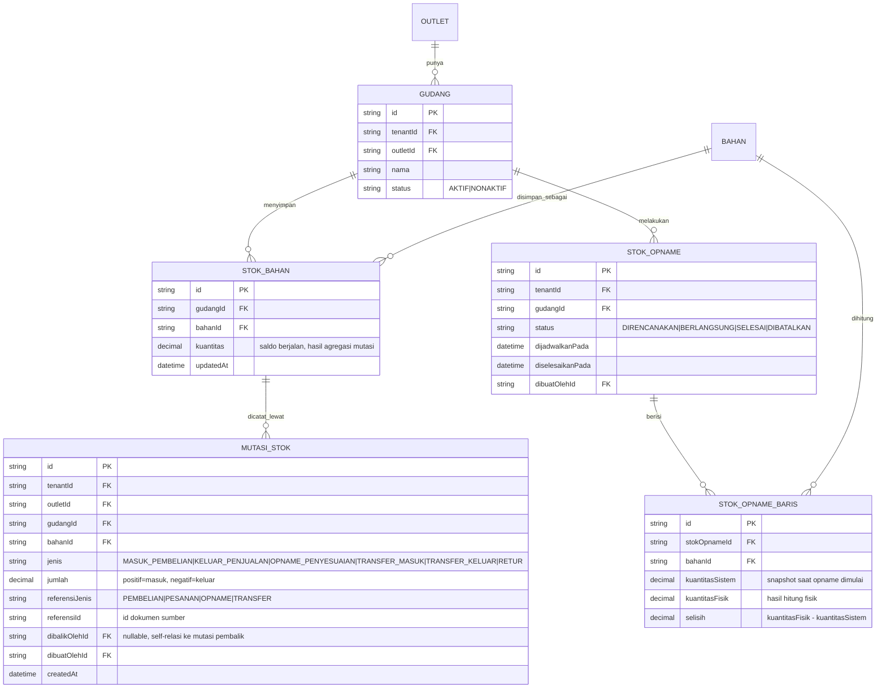

# ERD - Persediaan

Catatan (no hard-delete):

- `MUTASI_STOK` bersifat append-only. Koreksi kesalahan input dilakukan dengan menambah baris mutasi pembalik baru yang menunjuk lewat `dibalikOlehId`, bukan menghapus/mengubah baris lama.
- `STOK_BAHAN.kuantitas` adalah saldo turunan (derived) dari total `MUTASI_STOK` - didesain agar bisa direkonsiliasi ulang kapan saja dari log mutasi.
- Alur status `STOK_OPNAME` mengikuti state machine "Opname" di `docs/arsitektur/STATE-MACHINES.md`.
