# ERD - Persediaan

> **DIPERBARUI PADA BATCH ALT-DEF-008** (ADR-023/ADR-024/ADR-025 di
> `docs/engineering/DECISION-LOG.md`). ERD lama hanya memuat lima entitas
> (`GUDANG`, `STOK_BAHAN`, `MUTASI_STOK`, `STOK_OPNAME`, `STOK_OPNAME_BARIS`)
> dan enum `JenisMutasiStok` yang koarse.

## Aturan keras domain ini

**`MUTASI_STOK` adalah LEDGER APPEND-ONLY dan satu-satunya SUMBER KEBENARAN
saldo stok. `STOK_BAHAN` adalah CACHE TURUNAN (read-model) yang boleh dibuang
dan dihitung ulang kapan saja; ia TIDAK PERNAH otoritatif.**

1. Setiap peristiwa stok WAJIB menulis baris `MUTASI_STOK` baru. Tidak ada
   satu pun jalur yang boleh mengubah `STOK_BAHAN.kuantitas` tanpa baris
   mutasi pendampingnya dalam transaksi yang sama.
2. `STOK_BAHAN.kuantitas` WAJIB sama dengan `SUM(MUTASI_STOK.jumlah)` untuk
   `(gudangId, bahanId, lokasiStokId)` yang sama. Bila berbeda, **yang benar
   adalah ledger**; job rekonsiliasi menimpa baris cache, tidak pernah
   sebaliknya (kolom `direkonsiliasiPada` adalah tempat berpijaknya - job-nya
   sendiri adalah fitur berikutnya, belum ditulis).
3. Koreksi SELALU baris PEMBALIK baru (ADR-006). `MUTASI_STOK` tidak pernah
   di-UPDATE maupun di-DELETE - karena itu model ini sengaja tidak punya
   `updatedAt`, kolom status, maupun kolom soft-delete.
4. Opname TIDAK PERNAH menulis saldo langsung; ia memposting mutasi
   `KOREKSI_OPNAME` per baris.
5. Reservasi mengurangi stok **TERSEDIA** (`kuantitas - kuantitasDireservasi`),
   tidak pernah stok **FISIK**, dan SENGAJA bukan baris ledger.

> **KEJUJURAN YANG WAJIB DINYATAKAN:** poin 1-5 di atas **belum satu pun
> dijamin database**. Lihat tabel "Invariant level-aplikasi" di bawah.

```mermaid
erDiagram
    OUTLET ||--o{ GUDANG : punya
    GUDANG ||--o{ LOKASI_STOK : berisi
    GUDANG ||--o{ STOK_BAHAN : menyimpan
    LOKASI_STOK ||--o{ STOK_BAHAN : merinci
    BAHAN ||--o{ STOK_BAHAN : disimpan_sebagai
    BAHAN ||--o{ MUTASI_STOK : dicatat_lewat
    LOKASI_STOK ||--o{ MUTASI_STOK : sumber_atau_tujuan
    BAHAN ||--o{ BATCH_STOK : dibatch_sebagai
    BATCH_PRODUKSI |o--o| BATCH_STOK : menjadi
    BATCH_STOK ||--o{ MUTASI_STOK : dialokasikan_lewat
    ITEM_PESANAN ||--o{ RESERVASI_STOK : mengunci
    BAHAN ||--o{ RESERVASI_STOK : direservasi
    MUTASI_STOK |o--|| PENYESUAIAN_STOK : dihasilkan_oleh
    MUTASI_STOK |o--|| CATATAN_WASTE : dihasilkan_oleh
    ALASAN_WASTE ||--o{ CATATAN_WASTE : mengklasifikasi
    TRANSFER_STOK ||--o{ TRANSFER_STOK_BARIS : berisi
    TRANSFER_STOK_BARIS }o--o| MUTASI_STOK : keluar_dan_masuk
    BAHAN ||--o{ KEBIJAKAN_PEMESANAN_ULANG : diatur_oleh
    OUTLET ||--|| PENGATURAN_PERSEDIAAN_OUTLET : dikonfigurasi
    GUDANG ||--o{ STOK_OPNAME : melakukan
    STOK_OPNAME ||--o{ STOK_OPNAME_BARIS : berisi
    STOK_OPNAME_BARIS }o--o| MUTASI_STOK : memposting_koreksi
    BAHAN ||--o{ STOK_OPNAME_BARIS : dihitung

    GUDANG {
        string id PK
        string tenantId FK
        string outletId FK
        string nama
        string status "AKTIF|NONAKTIF"
    }
    LOKASI_STOK {
        string id PK
        string tenantId FK
        string outletId FK
        string gudangId FK "composite (outletId,gudangId) -> Gudang(outletId,id)"
        string nama
        string jenis "nullable: RAK|CHILLER|FREEZER|GUDANG_KERING|AREA_PERSIAPAN|LAINNYA"
        string status "AKTIF|NONAKTIF"
    }
    STOK_BAHAN {
        string id PK
        string tenantId FK
        string gudangId FK
        string bahanId FK
        string lokasiStokId FK "nullable: NULL=agregat level gudang"
        decimal kuantitas "CACHE turunan dari SUM(MUTASI_STOK.jumlah)"
        decimal kuantitasDireservasi "CACHE dari SUM(RESERVASI_STOK AKTIF)"
        datetime direkonsiliasiPada "nullable, seam job rekonsiliasi"
        datetime updatedAt
    }
    MUTASI_STOK {
        string id PK
        string tenantId FK
        string outletId FK
        string gudangId FK
        string bahanId FK
        string jenis "12 nilai, lihat tabel enum di bawah"
        decimal jumlah "positif=masuk, negatif=keluar (SATU sumber kebenaran arah)"
        string satuanId FK "nullable"
        string referensiJenis "PEMBELIAN|PESANAN|OPNAME|TRANSFER|PRODUKSI|WASTE|PENYESUAIAN|RETUR_PEMBELIAN|PEMAKAIAN_INTERNAL"
        string referensiId "id dokumen sumber"
        string lokasiSumberId FK "nullable"
        string lokasiTujuanId FK "nullable"
        string batchStokId FK "nullable, hasil alokasi FEFO/FIFO"
        int hargaPerolehan "nullable, rupiah bulat (ADR-005)"
        string catatan "nullable"
        string dibalikOlehId FK "nullable @unique, self-relasi ke mutasi pembalik"
        string dibuatOlehId FK
        datetime createdAt
    }
    BATCH_STOK {
        string id PK
        string tenantId FK
        string outletId FK
        string bahanId FK
        string nomorBatch "unik per (tenantId,bahanId)"
        datetime tanggalProduksi "nullable"
        datetime tanggalKedaluwarsa "nullable, kunci urut FEFO"
        decimal kuantitasAwal
        int hargaPerolehan "rupiah bulat (ADR-005)"
        string lokasiStokId FK "nullable"
        string batchProduksiId FK "nullable @unique per tenant - SEAM ke domain produksi"
        string status "TERSEDIA|HABIS|KEDALUWARSA|DIBUANG"
        datetime createdAt "kunci urut FIFO"
    }
    RESERVASI_STOK {
        string id PK
        string tenantId FK
        string outletId FK
        string itemPesananId FK "digantung pada BARIS, bukan Pesanan"
        string bahanId FK
        decimal jumlah
        string satuanId FK
        string status "AKTIF|DILEPAS|DIKONSUMSI|KEDALUWARSA"
        datetime kedaluwarsaPada "nullable"
        datetime createdAt
        datetime dilepasPada "nullable"
    }
    PENYESUAIAN_STOK {
        string id PK
        string tenantId FK
        string outletId FK
        string bahanId FK
        decimal jumlahSebelum
        decimal jumlahSesudah
        string alasan
        string disetujuiOlehId FK "nullable"
        string mutasiStokId FK "WAJIB @unique - jejak ledger"
        string dicatatOlehId FK
        datetime createdAt
    }
    TRANSFER_STOK {
        string id PK
        string tenantId FK
        string nomorTransfer "unik per tenant"
        string outletAsalId FK
        string gudangAsalId FK "composite (outletAsalId,gudangAsalId) -> Gudang(outletId,id)"
        string outletTujuanId FK
        string gudangTujuanId FK "composite (outletTujuanId,gudangTujuanId)"
        string status "DRAF|DIAJUKAN|DISETUJUI|DIKIRIM|DITERIMA_SEBAGIAN|DITERIMA|DIBATALKAN"
        string catatan "nullable"
        string dibuatOlehId FK
        string disetujuiOlehId FK "nullable"
        string dikirimOlehId FK "nullable"
        string diterimaOlehId FK "nullable"
        datetime diajukanPada "nullable"
        datetime disetujuiPada "nullable"
        datetime dikirimPada "nullable"
        datetime diterimaPada "nullable"
        datetime createdAt
    }
    TRANSFER_STOK_BARIS {
        string id PK
        string tenantId FK
        string transferStokId FK
        string bahanId FK
        decimal jumlahDiminta
        decimal jumlahDikirim "nullable"
        decimal jumlahDiterima "nullable"
        string satuanId FK
        string batchStokId FK "nullable"
        string mutasiKeluarId FK "nullable @unique, ditulis saat DIKIRIM"
        string mutasiMasukId FK "nullable @unique, ditulis saat DITERIMA"
    }
    ALASAN_WASTE {
        string id PK
        string tenantId FK
        string kode "unik per tenant"
        string nama
        string status "AKTIF|NONAKTIF"
    }
    CATATAN_WASTE {
        string id PK
        string tenantId FK
        string outletId FK
        string gudangId FK
        string lokasiStokId FK "nullable"
        string bahanId FK
        string batchStokId FK "nullable"
        string alasanWasteId FK "WAJIB - bukan teks bebas (ALT-PSD-014)"
        decimal jumlah
        string satuanId FK
        int nilaiKerugian "nullable, rupiah bulat"
        string catatan "nullable, MELENGKAPI alasan berkode"
        string mutasiStokId FK "WAJIB @unique - jejak ledger"
        string dicatatOlehId FK
        string disetujuiOlehId FK "nullable"
        datetime createdAt
    }
    KEBIJAKAN_PEMESANAN_ULANG {
        string id PK
        string tenantId FK
        string outletId FK
        string bahanId FK
        decimal stokMinimum "Decimal, bukan Int - lihat ALT-DEF-036"
        decimal stokMaksimum "nullable"
        decimal jumlahPemesananUlang "nullable"
        string metode "MIN_MAX|FIXED"
        string status "AKTIF|NONAKTIF"
    }
    PENGATURAN_PERSEDIAAN_OUTLET {
        string id PK
        string tenantId FK
        string outletId FK "unique - satu per outlet"
        string kebijakanPemotongan "SAAT_PESANAN_DITERIMA|SAAT_MASUK_DAPUR|SAAT_SELESAI|SAAT_PEMBAYARAN, default SAAT_MASUK_DAPUR"
        boolean reservasiSaatPesananDiterima "default true"
        int kedaluwarsaReservasiMenit "nullable"
        string metodeAlokasiBatch "FEFO|FIFO, default FEFO"
        boolean izinkanStokNegatif "default false"
        int ambangSelisihOpname "nullable, rupiah bulat"
    }
    STOK_OPNAME {
        string id PK
        string tenantId FK
        string gudangId FK
        string status "DRAF|SEDANG_DIHITUNG|DIKUNCI|MENUNGGU_PERSETUJUAN|DISETUJUI|DIPOSTING|DIBATALKAN"
        datetime dijadwalkanPada
        datetime snapshotPada "nullable, waktu kuantitas sistem dibekukan"
        datetime dikunciPada "nullable"
        datetime disetujuiPada "nullable"
        datetime dipostingPada "nullable"
        datetime dibatalkanPada "nullable"
        string alasan "nullable"
        string dibuatOlehId FK
        string penghitungId FK "nullable"
        string pengunciId FK "nullable"
        string penyetujuId FK "nullable"
    }
    STOK_OPNAME_BARIS {
        string id PK
        string stokOpnameId FK
        string bahanId FK
        string lokasiStokId FK "nullable"
        string batchStokId FK "nullable"
        decimal kuantitasSistem "snapshot pada StokOpname.snapshotPada"
        decimal kuantitasFisik "NULLABLE - belum dihitung != nol"
        decimal selisih "NULLABLE - kuantitasFisik - kuantitasSistem"
        string alasan "nullable"
        string mutasiKoreksiId FK "nullable @unique, jejak ledger setelah DIPOSTING"
        datetime dihitungPada "nullable"
    }
```

## Enum `JenisMutasiStok` (12 nilai) dan pemetaan dari enum lama

Arah **tidak** dibawa nama enum melainkan **tanda `jumlah`** - satu sumber
kebenaran arah. Kolom "Arah lazim" di bawah adalah konvensi, bukan constraint.

| Nilai | Arah lazim | Dokumen sumber (`referensiJenis`) |
|---|---|---|
| `PEMBELIAN_MASUK` | + | `PEMBELIAN` |
| `RETUR_PENJUALAN` | + | `PESANAN` |
| `TRANSFER_MASUK` | + | `TRANSFER` |
| `PRODUKSI_MASUK` | + | `PRODUKSI` |
| `PEMAKAIAN_RESEP` | - | `PESANAN` |
| `RETUR_SUPPLIER` | - | `RETUR_PEMBELIAN` |
| `TRANSFER_KELUAR` | - | `TRANSFER` |
| `PRODUKSI_KELUAR` | - | `PRODUKSI` |
| `WASTE` | - | `WASTE` |
| `PEMAKAIAN_INTERNAL` | - | `PEMAKAIAN_INTERNAL` |
| `PENYESUAIAN` | +/- | `PENYESUAIAN` |
| `KOREKSI_OPNAME` | +/- | `OPNAME` |

**Pemetaan nilai lama -> baru** (instruksi untuk migrasi kelak; belum ada satu
baris data pun karena belum ada migrasi yang pernah dijalankan, `ALT-DEF-029`):

| Lama | Baru | Catatan |
|---|---|---|
| `MASUK_PEMBELIAN` | `PEMBELIAN_MASUK` | Urutan kata saja; semantik identik. |
| `KELUAR_PENJUALAN` | `PEMAKAIAN_RESEP` | Nama lama salah secara konseptual - yang berkurang adalah BAHAN yang dipakai resep, bukan "penjualan". Satu penjualan bisa menghasilkan nol mutasi (item tanpa resep) atau belasan (satu per komponen). |
| `OPNAME_PENYESUAIAN` | `KOREKSI_OPNAME` | Dipisahkan dari `PENYESUAIAN` manual - jalur otorisasinya berbeda (`ALT-PSD-017`). |
| `TRANSFER_MASUK` | `TRANSFER_MASUK` | Tidak berubah. |
| `TRANSFER_KELUAR` | `TRANSFER_KELUAR` | Tidak berubah. |
| `RETUR` | `RETUR_PENJUALAN` **atau** `RETUR_SUPPLIER` | **AMBIGU** - nilai lama menutupi dua peristiwa berarah berlawanan. Pembeda: `referensiJenis = PESANAN` -> `RETUR_PENJUALAN`; `referensiJenis = PEMBELIAN` -> `RETUR_SUPPLIER`. |

## Seam `BATCH_PRODUKSI` <-> `BATCH_STOK` (ADR-024 Keputusan 3)

Keduanya **dipertahankan dan disambungkan FK 1:1 opsional**, tidak disatukan -
memenuhi handoff ADR-022 Keputusan 8 poin 4, yang memang sudah menyiapkan
`BatchProduksi.@@unique([tenantId, id])` untuk tujuan ini.

- `BATCH_PRODUKSI` (domain **produksi**) menjawab: *apa yang DIBUAT, dari
  proses mana, yield berapa*.
- `BATCH_STOK` (domain **persediaan**) menjawab: *apa yang ADA di rak, berapa
  harga perolehannya, di lokasi mana, kapan kedaluwarsa*.
- Penyatuan ditolak karena batch hasil **pembelian** tidak punya proses
  produksi sama sekali - menyatukan berarti seluruh kolom produksi nullable
  untuk mayoritas baris, dan kolom persediaan menumpang di tabel domain
  produksi.
- **INVARIANT LEVEL-APLIKASI:** setiap `BATCH_PRODUKSI` atas bahan
  `BAHAN_SETENGAH_JADI` wajib melahirkan tepat satu `BATCH_STOK` dalam
  transaksi yang sama dengan mutasi `PRODUKSI_MASUK`. Prisma tidak dapat
  mewajibkan sisi itu (kolomnya ada di `BATCH_STOK` dan harus nullable untuk
  batch pembelian).

## FEFO / FIFO (ADR-025 Keputusan 3) - logika service-layer

- **FEFO** (default): `BATCH_STOK` berstatus `TERSEDIA` diurutkan menaik
  menurut `tanggalKedaluwarsa`; batch tanpa tanggal kedaluwarsa diurutkan
  **terakhir**, lalu di antara sesamanya menurut `createdAt` - inilah FIFO
  fallback, berlaku otomatis tanpa konfigurasi terpisah.
- **FIFO**: urut murni `createdAt` menaik, mengabaikan kedaluwarsa.
- **Skema membawa cukup kolom untuk keduanya** (diverifikasi kolom per kolom):
  urut kedaluwarsa -> `tanggalKedaluwarsa`; urut penerimaan -> `createdAt`;
  umur produksi -> `tanggalProduksi`; sisa yang bisa dialokasikan ->
  `kuantitasAwal - SUM(MUTASI_STOK.jumlah WHERE batchStokId = ...)`; penyaring
  batch mati -> `status`; nilai persediaan -> `hargaPerolehan`. Indeks
  pendukung: `(tenantId, bahanId, status, tanggalKedaluwarsa)` dan
  `(tenantId, bahanId, status, createdAt)`.
- **Sisa batch sengaja TIDAK disimpan sebagai kolom** - itu akan menciptakan
  cache turunan kedua di samping `STOK_BAHAN`, persis kelas defect yang aturan
  keras di atas ada untuk mencegahnya.

## Kebijakan pemotongan stok dan stok negatif (ADR-025 Keputusan 1/4)

Dikonfigurasi lewat `PENGATURAN_PERSEDIAAN_OUTLET` (**kolom bertipe**, bukan
baris key-value `PengaturanOutlet` - alasan penolakan ada di ADR-025
Keputusan 1: nilai-nilai ini dibaca di jalur panas setiap pemotongan stok dan
salah ketik kunci Json akan diam-diam jatuh ke default, mengubah perilaku
potong-stok tanpa error apa pun).

| Kebijakan | Kapan mutasi ditulis |
|---|---|
| `SAAT_PESANAN_DITERIMA` | Saat `Pesanan -> DITERIMA`. |
| `SAAT_MASUK_DAPUR` (**default**) | Saat `Pesanan -> DIKIRIM_KE_DAPUR`; saat itulah bahan fisik mulai dipakai. |
| `SAAT_SELESAI` | Saat `Pesanan -> SELESAI`. |
| `SAAT_PEMBAYARAN` | Saat pembayaran dikonfirmasi. |

Apa pun kebijakannya, **reservasi** (`RESERVASI_STOK`) dibuat saat pesanan
`DITERIMA` bila `reservasiSaatPesananDiterima = true` - ia menutup jendela
antara pesanan diterima dan bahan benar-benar dipakai, tanpa menyentuh saldo
fisik.

**Stok negatif:** `izinkanStokNegatif` default `false` -> operasi yang akan
menurunkan stok **TERSEDIA** di bawah nol ditolak `409 STOK_TIDAK_CUKUP`.
Bila `true`, operasi tetap diposting, saldo boleh negatif, dan mutasinya wajib
memicu notifikasi ke peran GUDANG/MANAJER (tidak pernah senyap).

## Integritas reversal (ADR-023 Keputusan 5)

`MUTASI_STOK.dibalikOlehId String? @unique` - **diverifikasi ulang** di batch
ini, bukan diasumsikan benar.

| # | Aturan | Dijamin? |
|---|---|---|
| 1 | Satu mutasi dibalik paling banyak sekali | **YA, DB** - `dibalikOlehId` kolom TUNGGAL; tidak ada tempat untuk pembalik kedua. |
| 2 | Satu pembalik membalik paling banyak satu asal | **YA, DB** - `@unique`. |
| 3 | `jumlah` pembalik berlawanan tanda tepat | TIDAK - trigger di SQL manual 005, belum dijalankan. |
| 4 | Pembalik di tenant/gudang/bahan yang sama | TIDAK - idem. |
| 5 | Larangan rantai pembalik-dari-pembalik | TIDAK - idem. |

Aturan 3-5 adalah invariant **lintas-baris**; CHECK constraint Postgres
dilarang membaca baris lain, sehingga satu-satunya penegak level-data yang
mungkin adalah trigger.

## Invariant level-aplikasi (tidak ada satu pun yang dijamin database saat ini)

| # | Invariant | Penegak yang direncanakan | Status |
|---|---|---|---|
| 1 | `mutasi_stok` append-only | trigger, SQL manual `005` | BELUM DIJALANKAN |
| 2 | Pembalik berlawanan tanda & sepadan | trigger, SQL manual `005` | BELUM DIJALANKAN |
| 3 | Satu baris `STOK_BAHAN` agregat per (gudang, bahan) | partial unique index, SQL manual `004` | BELUM DIJALANKAN |
| 4 | Satu baris opname agregat per (opname, bahan) | partial unique index, SQL manual `004` | BELUM DIJALANKAN |
| 5 | `kuantitas == SUM(MUTASI_STOK.jumlah)` | job rekonsiliasi (kode, belum ditulis) | **TIDAK PERNAH DB-ENFORCED** |
| 6 | `SUM(RESERVASI_STOK AKTIF) <= saldo fisik` | guard transaksi + `FOR UPDATE` | **TIDAK PERNAH DB-ENFORCED** |
| 7 | Stok tidak negatif (bila kebijakan melarang) | guard transaksi + `FOR UPDATE` | **TIDAK PERNAH DB-ENFORCED** |
| 8 | Setiap `BATCH_PRODUKSI` bahan setengah jadi -> satu `BATCH_STOK` | guard transaksi produksi | **TIDAK PERNAH DB-ENFORCED** |
| 9 | `lokasiSumber`/`lokasiTujuan` sesuai jenis mutasi | validasi service-layer | TIDAK DITEGAKKAN |
| 10 | `gudangAsal != gudangTujuan`; `diterima <= dikirim <= diminta` | validasi service-layer | UTANG CHECK constraint |
| 11 | `penghitungId != penyetujuId` pada opname | validasi service-layer | UTANG CHECK constraint |

Baris 5-9 **tidak akan menjadi DB-enforced meski seluruh file SQL manual
dijalankan** - ia invariant agregat/kondisional yang berada di luar jangkauan
constraint deklaratif. Dinyatakan agar "jalankan migrasi" tidak disalahartikan
sebagai penutup seluruh daftar ini.

## Catatan lain (no hard-delete)

- `MUTASI_STOK` bersifat append-only. Koreksi kesalahan input dilakukan dengan
  menambah baris mutasi pembalik baru yang menunjuk lewat `dibalikOlehId`,
  bukan menghapus/mengubah baris lama.
- Alur status `STOK_OPNAME` dan `TRANSFER_STOK` mengikuti state machine di
  `docs/arsitektur/STATE-MACHINES.md` bagian 7 dan 8.
- `ALASAN_WASTE` dinonaktifkan lewat `status`, tidak pernah dihapus - histori
  `CATATAN_WASTE` yang merujuknya harus tetap terbaca (ADR-006).
- **Penamaan `STOK_BAHAN` vs `SaldoStok` (ADR-023 Keputusan 3):**
  `MASTER-CHECKLIST.md` `ALT-PSD-007` menyebut entitas `SaldoStok`. Model yang
  ada tetap bernama `StokBahan`; `SaldoStok` diperlakukan sebagai **alias
  dokumentasi**. Yang berubah bukan namanya melainkan **statusnya** - ia kini
  dinyatakan eksplisit sebagai cache turunan, yang sebelumnya tidak pernah
  dinyatakan di mana pun.
- **ALT-DEF-010 (composite tenant/outlet-scoped FK, lihat ADR-013):**
  `GUDANG.outletId` composite-FK `(tenantId, outletId) -> Outlet(tenantId, id)`.
  `STOK_BAHAN` sebelumnya TIDAK punya `tenantId` sama sekali (gap ditemukan
  saat audit) - kini `tenantId` + DUA composite-FK ke `Gudang(tenantId, id)`
  dan `Bahan(tenantId, id)`. `MUTASI_STOK.gudangId` sebelumnya kolom TANPA
  relasi FK sama sekali - kini composite-FK ke `Gudang(tenantId, id)`;
  `MUTASI_STOK.bahanId` juga composite-FK ke `Bahan(tenantId, id)`.
  `STOK_OPNAME.gudangId` juga composite-FK ke `Gudang(tenantId, id)`.
- **ALT-DEF-008 tambahan composite-FK:** `GUDANG` mendapat
  `@@unique([outletId, id])` baru; `LOKASI_STOK` dan `TRANSFER_STOK` memakai
  varian **outlet-level** (ADR-013 poin 3) sehingga lokasi/gudang tidak bisa
  menunjuk milik outlet lain dalam tenant yang sama - jaminan yang tidak
  didapat dari composite `(tenantId, gudangId)` saja, dan transfer justru
  operasi yang menyeberangi outlet. `MUTASI_STOK.dibuatOlehId` sebelumnya
  kolom TANPA relasi FK sama sekali (gap yang sama seperti `gudangId` dulu) -
  kini FK ID tunggal ke `Pengguna` (ADR-013 poin 5: relasi ke `Pengguna` tidak
  pernah di-composite-kan ke tenant).
