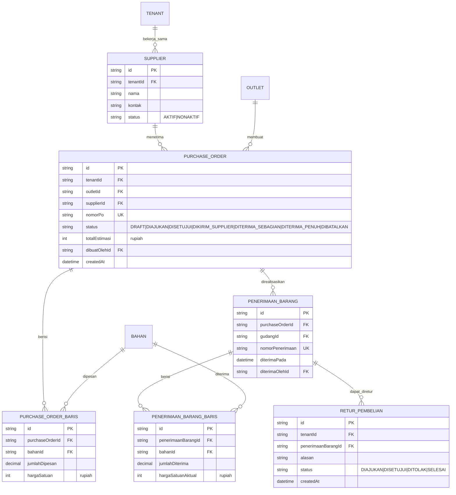

# ERD - Supplier & Pembelian

Catatan:

- Alur status `PURCHASE_ORDER` mengikuti state machine "Pembelian" di `docs/arsitektur/STATE-MACHINES.md`.
- `PENERIMAAN_BARANG_BARIS` yang diterima memicu baris baru di `MUTASI_STOK` (jenis `MASUK_PEMBELIAN`) - lihat `04-persediaan.md`.
- Pembatalan PO tidak menghapus baris - hanya mengubah `status` menjadi `DIBATALKAN`.
- **ALT-DEF-010 (composite tenant/outlet-scoped FK, lihat ADR-013 di `docs/engineering/DECISION-LOG.md`):** `PURCHASE_ORDER.outletId` kini composite-FK `(tenantId, outletId) -> Outlet(tenantId, id)`, dan `PURCHASE_ORDER.supplierId` kini composite-FK `(tenantId, supplierId) -> Supplier(tenantId, id)` - menjamin PO tidak bisa merujuk supplier milik tenant lain. `PENERIMAAN_BARANG` sebelumnya TIDAK punya `tenantId` sama sekali (gap ditemukan saat audit) - kini ditambahkan `tenantId` + DUA composite-FK sekaligus ke `PurchaseOrder(tenantId, id)` dan `Gudang(tenantId, id)`.
- **ADR-033:** `PurchaseOrder.dibuatOlehId` dipindah ke composite-FK OUTLET-LEVEL `(tenantId, outletId, dibuatOlehId) -> KeanggotaanOutlet(tenantId, outletId, id)`; `PenerimaanBarang.diterimaOlehId` dipindah ke composite-FK TENANT-LEVEL `(tenantId, diterimaOlehId) -> KeanggotaanTenant(tenantId, id)` - keduanya sebelumnya FK langsung ke `Pengguna`. Lihat `docs/engineering/DECISION-LOG.md` ADR-033.
