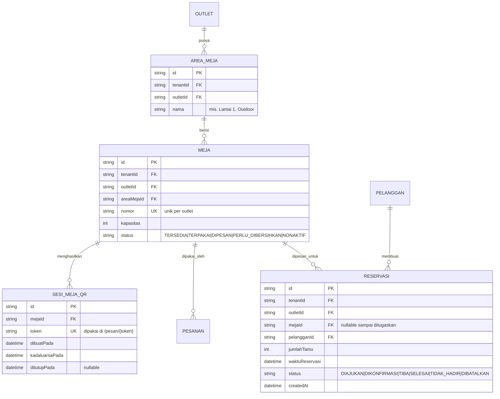

# ERD - Meja & Reservasi

Catatan:

- Alur status `MEJA` dan `RESERVASI` mengikuti state machine "Meja" di `docs/arsitektur/STATE-MACHINES.md`.
- `SESI_MEJA_QR.token` adalah token unik per sesi duduk yang dipakai pada rute publik `/pesan/{token}` (lihat `docs/ui-ux/ROUTE-MAP.md`); ditutup (bukan dihapus) saat meja selesai dipakai.
