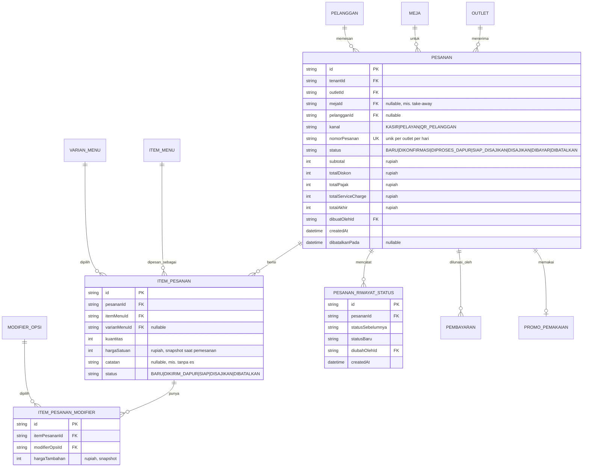

# ERD - Pesanan

Catatan:

- Alur `PESANAN.status` mengikuti state machine "Pesanan" di `docs/arsitektur/STATE-MACHINES.md`; setiap transisi dicatat di `PESANAN_RIWAYAT_STATUS` (append-only, untuk audit & analitik).
- Harga (`hargaSatuan`, `hargaTambahan`) selalu disimpan sebagai **snapshot** pada saat pemesanan - perubahan harga menu di kemudian hari tidak mengubah nilai pesanan lama.
- Pembatalan pesanan tidak menghapus baris - `status` menjadi `DIBATALKAN` dan `dibatalkanPada` diisi.
- `packages/dapur` membaca domain ini HANYA lewat read-contract `kontrak-dapur` (subset field: id pesanan, item, catatan, status dapur, meja/nomor) - lihat `08-dapur.md`.
- **ALT-DEF-010 (composite tenant/outlet-scoped FK, lihat ADR-013 di `docs/engineering/DECISION-LOG.md`):** `PESANAN.outletId` kini composite-FK `(tenantId, outletId) -> Outlet(tenantId, id)`; `PESANAN.mejaId` (nullable) kini composite-FK level-outlet `(outletId, mejaId) -> Meja(outletId, id)` - menjamin meja yang dirujuk berada di outlet yang sama dengan pesanan; `PESANAN.pelangganId` (nullable) kini composite-FK `(tenantId, pelangganId) -> Pelanggan(tenantId, id)`.
