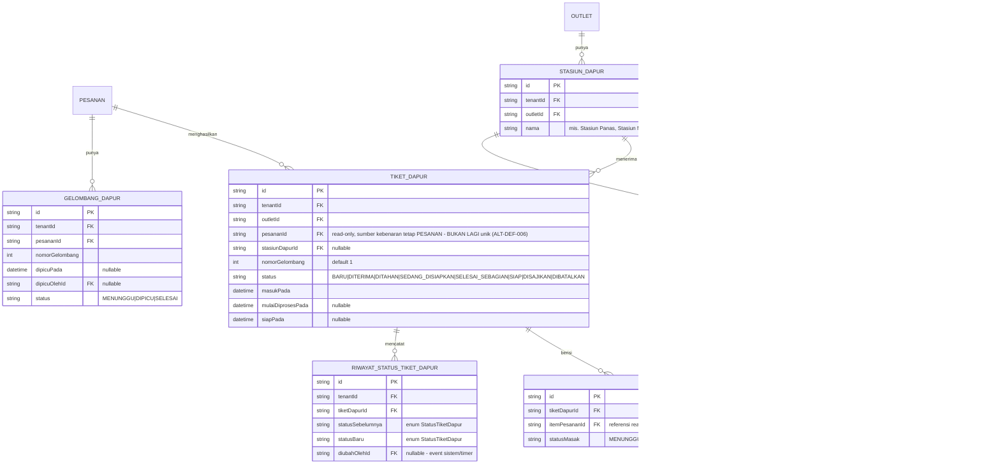

# ERD - Dapur (Kitchen Display System)

`packages/dapur` tidak memiliki tabel transaksional sendiri untuk item pesanan - ia membaca **read-contract** dari domain Pesanan (`@altora/pesanan/kontrak-dapur`) dan hanya menulis status "progres masak" miliknya sendiri di tabel berikut.

**ALT-DEF-006 (correction-loop lanjutan):** ERD di bawah menggantikan diagram
lama 1:1 (`Pesanan ||--o| TiketDapur`). Lihat ADR-018 di
`docs/engineering/DECISION-LOG.md` untuk rasional desain lengkap dari setiap
keputusan di bawah.

Catatan:

- `TIKET_DAPUR` dan `TIKET_DAPUR_BARIS` adalah tabel MILIK dapur (boleh ditulis oleh `packages/dapur`), tetapi field yang merujuk ke pesanan (`pesananId`, `itemPesananId`) hanya boleh **dibaca**, bukan diubah - perubahan itemnya sendiri (nama, harga, kuantitas) hanya lewat domain Pesanan.
- Update `TIKET_DAPUR.status` mengikuti state machine "Dapur (Tiket Dapur)" di `docs/arsitektur/STATE-MACHINES.md`, dan memicu event yang dikonsumsi domain Pesanan untuk memperbarui `PESANAN.status`/`ITEM_PESANAN.status` (lewat kontrak, bukan write langsung lintas domain).
- **ALT-DEF-010 (composite tenant/outlet-scoped FK, lihat ADR-013 di `docs/engineering/DECISION-LOG.md`):** `STASIUN_DAPUR.outletId` dan `TIKET_DAPUR.outletId` kini composite-FK `(tenantId, outletId) -> Outlet(tenantId, id)`. `TIKET_DAPUR.stasiunDapurId` (nullable) kini composite-FK level-outlet `(outletId, stasiunDapurId) -> StasiunDapur(outletId, id)` - menjamin stasiun dapur yang dirujuk berada di outlet yang sama dengan tiket. `TIKET_DAPUR.pesananId` kini composite-FK `(tenantId, pesananId) -> Pesanan(tenantId, id)` - menjamin tiket dapur tidak bisa merujuk pesanan tenant lain meskipun `tenantId` dicatat terpisah di kedua tabel.
- **ALT-DEF-006 (KDS multi-stasiun, lihat ADR-018):** `TIKET_DAPUR.pesananId` TIDAK LAGI unik - satu `PESANAN` kini dapat menghasilkan BANYAK `TIKET_DAPUR` (satu per stasiun tujuan/gelombang). Constraint baru `@@unique([pesananId, stasiunDapurId, nomorGelombang])` menjamin paling banyak SATU tiket per kombinasi (pesanan, stasiun, gelombang) - mencegah duplikasi tiket yang tidak sengaja sambil mengizinkan banyak tiket lintas stasiun/gelombang. `TIKET_DAPUR_BARIS.itemPesananId` TETAP unik per baris (satu `ItemPesanan` pergi ke tepat satu tiket di bawah routing gelombang-tunggal normal - lihat ADR-018 Keputusan 2 untuk rasional lengkap termasuk skenario re-fire/repeat-course).
- **`ATURAN_ROUTING_DAPUR` (ALT-DPR-002):** tabel lookup murni yang menentukan item menu/kategori menu tertentu diarahkan ke stasiun dapur mana (mis. "Kopi -> Bar", "Nasi -> Dapur", "Dessert -> Stasiun Dessert"). Tepat satu dari `itemMenuId`/`kategoriMenuId` harus diisi (XOR) - **invariant level-aplikasi**, bukan constraint database (lihat ADR-018 Keputusan 4). Pembuatan `TIKET_DAPUR` nyata yang MEMBACA tabel ini saat pesanan dikonfirmasi adalah handler/feature work di luar scope batch ini.
- **`RIWAYAT_STATUS_TIKET_DAPUR` (audit transisi status tiket):** mengikuti pola enum-typed history yang sama seperti `PesananRiwayatStatus` (ALT-DEF-005) - `statusSebelumnya`/`statusBaru` bertipe enum `StatusTiketDapur`, bukan `String` bebas. `diubahOlehId` nullable untuk event sistem/timer tanpa aktor manusia.
- **`GELOMBANG_DAPUR` (ALT-DEF-006, model nyata - lihat ADR-018 Keputusan 3):** menyimpan metadata AGREGAT per gelombang masak (kapan gelombang dipicu secara eksplisit, oleh siapa, dan status agregat lintas-tiket/lintas-stasiun) yang tidak dimiliki satu `TIKET_DAPUR` individual. `TIKET_DAPUR.nomorGelombang` (scalar `Int` polos) tetap ada di kedua sisi tanpa relasi FK wajib antar keduanya, karena baris `GELOMBANG_DAPUR` bersifat opsional secara bisnis (hanya dibuat saat ada pemicuan bertahap sungguhan, bukan untuk setiap gelombang default/tunggal).
- `StatusMasakBaris` (`MENUNGGU`/`DIMASAK`/`SIAP`, di `TIKET_DAPUR_BARIS`) TETAP terpisah dari `StatusTiketDapur` (di `TIKET_DAPUR`) - lihat ADR-018 Keputusan 6 untuk alasan keduanya tidak digabung.
