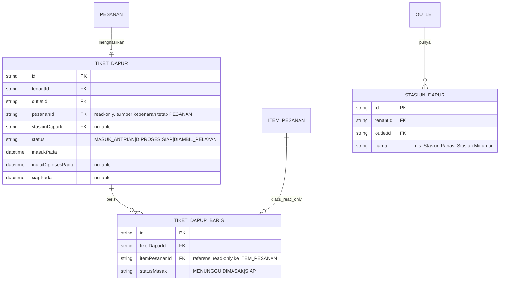

# ERD - Dapur (Kitchen Display System)

`packages/dapur` tidak memiliki tabel transaksional sendiri untuk item pesanan - ia membaca **read-contract** dari domain Pesanan (`@altora/pesanan/kontrak-dapur`) dan hanya menulis status "progres masak" miliknya sendiri di tabel berikut.

Catatan:

- `TIKET_DAPUR` dan `TIKET_DAPUR_BARIS` adalah tabel MILIK dapur (boleh ditulis oleh `packages/dapur`), tetapi field yang merujuk ke pesanan (`pesananId`, `itemPesananId`) hanya boleh **dibaca**, bukan diubah - perubahan itemnya sendiri (nama, harga, kuantitas) hanya lewat domain Pesanan.
- Update `TIKET_DAPUR.status` mengikuti state machine "Dapur" di `docs/arsitektur/STATE-MACHINES.md`, dan memicu event yang dikonsumsi domain Pesanan untuk memperbarui `PESANAN.status`/`ITEM_PESANAN.status` (lewat kontrak, bukan write langsung lintas domain).
- **ALT-DEF-010 (composite tenant/outlet-scoped FK, lihat ADR-013 di `docs/engineering/DECISION-LOG.md`):** `STASIUN_DAPUR.outletId` dan `TIKET_DAPUR.outletId` kini composite-FK `(tenantId, outletId) -> Outlet(tenantId, id)`. `TIKET_DAPUR.stasiunDapurId` (nullable) kini composite-FK level-outlet `(outletId, stasiunDapurId) -> StasiunDapur(outletId, id)` - menjamin stasiun dapur yang dirujuk berada di outlet yang sama dengan tiket. `TIKET_DAPUR.pesananId` kini composite-FK `(tenantId, pesananId) -> Pesanan(tenantId, id)` - menjamin tiket dapur tidak bisa merujuk pesanan tenant lain meskipun `tenantId` dicatat terpisah di kedua tabel.
