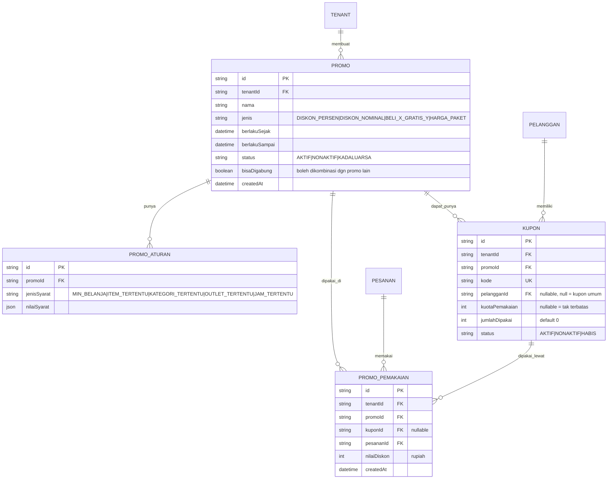

# ERD - Promo

Catatan:

- Kombinasi promo (`bisaDigabung`) dan urutan evaluasi aturan divalidasi di `packages/promo` saat kalkulasi total pesanan; `PROMO_PEMAKAIAN` menyimpan hasil akhir sebagai jejak audit (berapa diskon riil yang diberikan), bukan hanya referensi promo.
