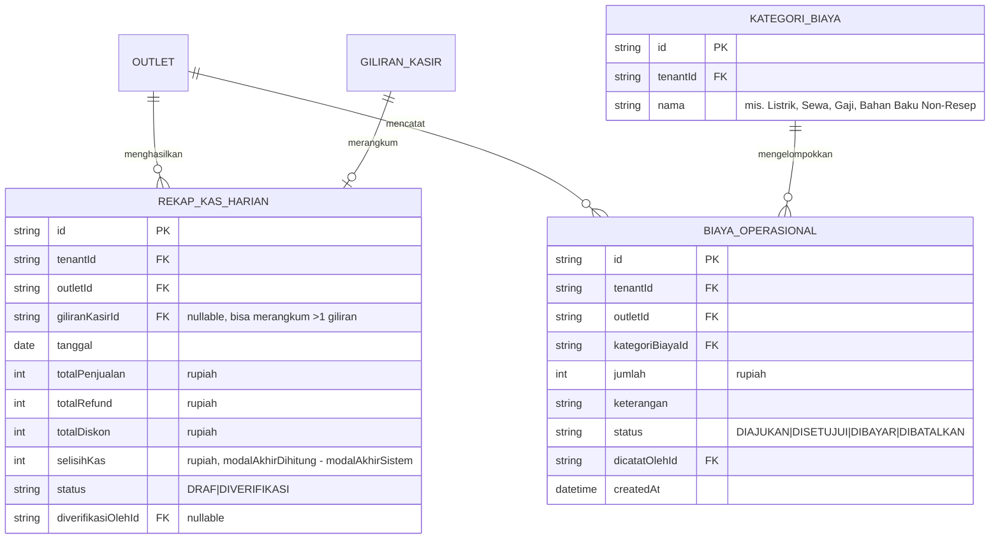

# ERD - Keuangan Internal

Catatan:

- Tidak ada hard-delete pada data keuangan - pembatalan biaya operasional memakai `status = DIBATALKAN`, bukan penghapusan baris.
- `REKAP_KAS_HARIAN` adalah agregat harian yang dihasilkan dari `GILIRAN_KASIR`, `PEMBAYARAN`, dan `PEMBAYARAN_REFUND` (domain Pembayaran/Kasir) - lihat `09-pembayaran-kasir.md`.
- Modul Keuangan pada rilis awal bersifat "keuangan internal restoran" (rekap kas & biaya operasional), belum termasuk akuntansi/pembukuan penuh (neraca, buku besar berpasangan) - itu di luar cakupan bagian 12 spec untuk fase ini.
- **ALT-DEF-010 (composite tenant/outlet-scoped FK, lihat ADR-013 di `docs/engineering/DECISION-LOG.md`):** `REKAP_KAS_HARIAN.outletId` kini composite-FK ke `Outlet(tenantId, id)`, dan `REKAP_KAS_HARIAN.giliranKasirId` (nullable) kini composite-FK `(tenantId, giliranKasirId) -> GiliranKasir(tenantId, id)`. `BIAYA_OPERASIONAL.outletId` kini composite-FK ke `Outlet(tenantId, id)`, dan `BIAYA_OPERASIONAL.kategoriBiayaId` kini composite-FK `(tenantId, kategoriBiayaId) -> KategoriBiaya(tenantId, id)`.
