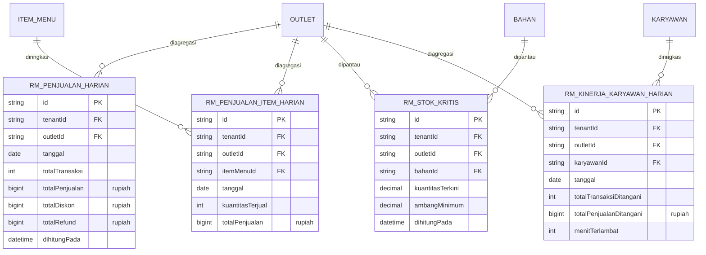

# ERD - Analitik (Read Model)

`packages/analitik` **tidak pernah** membaca tabel transaksional mentah (`PESANAN`, `PEMBAYARAN`, `MUTASI_STOK`, dst) secara langsung. Semua dashboard dan laporan dibaca dari tabel read-model berikut, yang diisi lewat proses agregasi terjadwal/event-driven terpisah dari jalur transaksi utama.

Catatan:

- Semua tabel `RM_*` bersifat read-model (denormalisasi, hasil agregasi) dan aman untuk dibaca oleh `packages/analitik` sesuai aturan dependency-cruiser.
- Proses pengisian read-model (job agregasi harian, atau event-driven) berada di luar `packages/analitik` itu sendiri (mis. worker terjadwal yang membaca tabel transaksional dan menulis ke `RM_*`) - ini akan dirinci pada implementasi loop Analitik.
- **ALT-DEF-010 (composite tenant/outlet-scoped FK, lihat ADR-013 di `docs/engineering/DECISION-LOG.md`):** keempat tabel `RM_*` kini memakai composite-FK `(tenantId, outletId) -> Outlet(tenantId, id)` untuk kolom `outletId`-nya. `RM_PENJUALAN_ITEM_HARIAN.itemMenuId` kini composite-FK ke `ItemMenu(tenantId, id)`; `RM_STOK_KRITIS.bahanId` kini composite-FK ke `Bahan(tenantId, id)`; `RM_KINERJA_KARYAWAN_HARIAN.karyawanId` kini composite-FK ke `Karyawan(tenantId, id)`.
